# EGO数据管线（DAQ SDK）使用手册 · User Manual

> 版本：**v1.2.0** ｜ 适用：采集端主程序 + 极简版（lite）｜ 读者：普通采集操作员（无需编程背景）
> 一句话定位：用相机 + 手套传感器录制多模态数据，回放检查，一键上传到服务器。

**[🇬🇧 English](#part-en)** ｜ **[🇨🇳 中文](#part-cn)**

（点击上方按钮在 English Manual 与「中文完整版」两个半区之间跳转，两半区内容一一对应 — Click a button above to jump between the English Manual and the 中文完整版; the two halves correspond one-to-one）


---

<a id="part-en"></a>

# English Manual

<a id="en-toc"></a>

## Table of Contents

**Chapter 1 Download the Code**
- [1.1 Where to Get It](#en-ch1-1) ｜ [1.2 Download & Extract](#en-ch1-2) ｜ [1.3 Directory Overview](#en-ch1-3) ｜ [1.4 Version & License](#en-ch1-4)

**Chapter 2 One-Click Setup**
- [2.1 Before You Start](#en-ch2-1) ｜ [2.2 Windows: Double-Click start.bat](#en-ch2-2) ｜ [2.3 Linux: ./start.sh](#en-ch2-3) ｜ [2.4 Everyday Commands](#en-ch2-4) ｜ [2.5 Optional Packs: extras / extras-torch](#en-ch2-5) ｜ [2.6 Fully Offline Setup (for Admins)](#en-ch2-6) ｜ [2.7 Lite Edition Setup](#en-ch2-7) ｜ [2.8 Setup Failed?](#en-ch2-8)

**Chapter 3 The Interface (Main Edition)**
- [3.1 Launch & Login](#en-ch3-1) ｜ [3.2 Main Window Overview](#en-ch3-2) ｜ [3.3 Dock Panels & Status Bar](#en-ch3-3) ｜ [3.4 Switching Chinese / English](#en-ch3-4) ｜ [3.5 Quick-Start Guide Window](#en-ch3-5) ｜ [3.6 The Lite Edition](#en-ch3-6)

**Chapter 4 Connecting to the Backend Server**
- [4.1 Server Address](#en-ch4-1) ｜ [4.2 Login & Credentials](#en-ch4-2) ｜ [4.3 Connection Status & Task Sync](#en-ch4-3) ｜ [4.4 Expired Session & Switching Accounts](#en-ch4-4) ｜ [4.5 One Word for Admins](#en-ch4-5)

**Chapter 5 Viewing Project Tasks**
- [5.1 Task List & Status Badges](#en-ch5-1) ｜ [5.2 Selecting a Task](#en-ch5-2) ｜ [5.3 Refresh, Delete & Where Tasks Come From](#en-ch5-3)

**Chapter 6 Connecting Devices**
- [6.0 Supported Devices at a Glance](#en-ch6-0) ｜ [6.1 UVC Cameras](#en-ch6-1) ｜ [6.2 RealSense D435 / D405](#en-ch6-2) ｜ [6.3 Stereo Cameras S80C / S80M](#en-ch6-3) ｜ [6.4 USB Type-C Glove](#en-ch6-4) ｜ [6.5 BLE Glove](#en-ch6-5) ｜ [6.6 Hand-Side Binding & Device Names](#en-ch6-6) ｜ [6.7 Everyday Device Panel Operations](#en-ch6-7) ｜ [6.8 Device Not Detected?](#en-ch6-8)

**Chapter 7 Live Recording**
- [7.1 Starting a Recording](#en-ch7-1) ｜ [7.2 Finishing (Saving)](#en-ch7-2) ｜ [7.3 Aborting (Discarding)](#en-ch7-3) ｜ [7.4 Interruptions While Recording](#en-ch7-4) ｜ [7.5 Live Parameters](#en-ch7-5) ｜ [7.6 Video Encoding Options](#en-ch7-6) ｜ [7.7 Dropped Frames & Health Hints](#en-ch7-7) ｜ [7.8 Recording in the Lite Edition](#en-ch7-8)

**Chapter 8 Playback, Upload, Delete**
- [8.1 Opening Playback](#en-ch8-1) ｜ [8.2 Playback Controls](#en-ch8-2) ｜ [8.4 Uploading](#en-ch8-4) ｜ [8.5 Auto-Upload & Auto-Delete](#en-ch8-5) ｜ [8.6 Deleting Recordings](#en-ch8-6) ｜ [8.7 Uploading from the Lite Edition](#en-ch8-7)

**Chapter 9 The Data Structure on Disk**
- [9.1 Overview & Numbering](#en-ch9-1) ｜ [9.2 videos/ — Video Files](#en-ch9-2) ｜ [9.3 data/ — Sensor Parquet](#en-ch9-3) ｜ [9.4 meta/ — Metadata](#en-ch9-4) ｜ [9.5 Other Local Files](#en-ch9-5) ｜ [9.6 What the Data Is Good For](#en-ch9-6)

**Appendices**
- [Appendix A Image Insertion Checklist](#en-app-a) ｜ [Appendix B Error Codes & Troubleshooting](#en-app-b) ｜ [Appendix C Lite vs. Main Comparison](#en-app-c) ｜ [Appendix D Toolchain (Brief)](#en-app-d) ｜ [Appendix E Document Index & Support](#en-app-e)

---

<a id="en-ch1"></a>

# Chapter 1 Download the Code

<a id="en-ch1-1"></a>

## 1.1 Where to Get It

This is an open-source project. The code and project pages are published in two places:

| Channel | URL | For whom |
|---|---|---|
| GitHub (open source) | `https://github.com/Stouching-robotics/DAQ_sdk.git` | All users — download the code here (Code → Download ZIP) |
| Hugging Face Space | `https://huggingface.co/spaces/Stouching-Robotics` | Project showcase space (online demo page) |

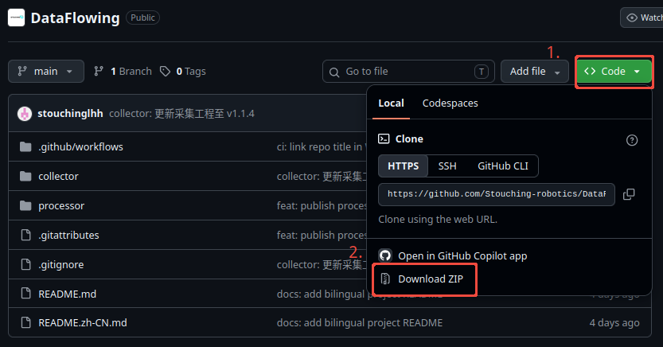

**You do not need git.** Just click the download button on the page and grab the `.zip` archive.

<a id="en-ch1-2"></a>

## 1.2 Download & Extract

1. Extract the zip anywhere; a **short, plain-English path** is recommended (e.g. `D:\collector`).
2. ⚠️ **Key check**: after extraction, `start.bat` and `main.py` must sit in the **same folder**. Some unzip tools add an extra nesting level — if `start.bat` complains it cannot find `main.py` (error code G), go one folder deeper.
3. ⚠️ Do not copy `start.bat` out on its own — it only works together with the whole project folder.

<a id="en-ch1-3"></a>

## 1.3 Directory Overview

After extraction you will see these items; only the listed ones matter to you:

| Item | Purpose |
|---|---|
| `start.bat` / `start.sh` | **One-click setup + launch** (Windows / Linux) — use these the first time |
| `run.bat` / `run.sh` | Direct launch (fastest, for everyday use after setup) |
| `main.py` | Main program entry (you won't run it manually) |
| `data/` | **All your recordings + local config live here** — back up by copying the whole folder |
| `start_lite.bat` / `start_lite.sh` | **Lite edition** one-click setup + launch (own env `venv_lite/`), see 2.7 |
| `lite_package/` | Lite edition distribution folder (a ready-to-ship copy of the same thing; on Linux it also carries the ~460 MB gripper payload — see 2.7) |
| `wheels/` | Offline installer packages (prepared by admins; ignore if absent) |
| `docs/` | Documentation set |

Leave `core/`, `ui/`, `config/`, `tools/` alone — they are program internals.

<a id="en-ch1-4"></a>

## 1.4 Version & License

- **Current version**: v1.2.0 (visible in the window title and the About dialog).
- **This manual applies to v1.2.0**; after upgrades, trust the actual UI.
- **License**: TBD; third-party components (FaysSense SDK, model weights, ffmpeg) follow their upstream licenses.

> ↑ [Back to TOC](#en-toc)

---

<a id="en-ch2"></a>

# Chapter 2 One-Click Setup

<a id="en-ch2-1"></a>

## 2.1 Before You Start

| Check | Requirement |
|---|---|
| OS | Windows 10/11 (64-bit); Linux in 2.3 |
| Free disk | ≥ 2 GB |
| Network | Recommended (offline machines: see 2.6) |
| Python | **Not required** — the script finds or installs it |
| First setup | About 3–10 minutes; afterwards every launch is instant |

<a id="en-ch2-2"></a>

## 2.2 Windows: Double-Click start.bat

Double-click **`start.bat`**. The script runs six steps and prints them in the console:

| Step | What happens |
|---|---|
| [1/6] Locate Python | Finds Python ≥ 3.10 (3.12 recommended). **If missing, downloads and silently installs Python 3.12.10** (~25 MB, from Aliyun/npmmirror/Huawei mirrors) |
| [2/6] Create venv | Creates an isolated `venv/` in the project folder |
| [3/6] Install dependencies | Tries offline `wheels/` → Aliyun PyPI mirror → Tsinghua mirror → official PyPI |
| [4/6] Self-check | Imports `main` to verify everything works |
| [5/6] Optional packs | Skipped by default, see 2.5 |
| [6/6] Launch | Starts the main program and pops up the Quick-Start Guide (3.5) |

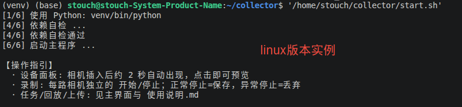

**Two important warnings**:

1. ⚠️ `start.bat` is a **GBK-encoded** file: do **not** open and re-save it with Notepad/VSCode (it becomes UTF-8 and silently fails). Re-download the original if it breaks.
2. ⚠️ SmartScreen/antivirus warnings: see Appendix B.4.

<a id="en-ch2-3"></a>

## 2.3 Linux: ./start.sh

Run `./start.sh` in the project folder — same six steps and sub-commands as Windows. Differences:

- Linux will **not auto-install Python**: install it via your package manager first (e.g. Ubuntu: `sudo apt install python3.12 python3-venv`); the script prints the exact command if it is missing;
- Everything else (offline packages first, mirror fallback, self-check, guide popup) behaves the same.

<a id="en-ch2-4"></a>

## 2.4 Everyday Commands

| Command (Windows) | Command (Linux) | Purpose |
|---|---|---|
| Double-click `start.bat` | `./start.sh` | Setup (as needed) + launch |
| `start.bat reinstall` | `./start.sh reinstall` | Delete venv and force reinstall — **first resort when something breaks** |
| `start.bat extras` | `./start.sh extras` | Add mediapipe + pyrealsense2 (see 2.5) |
| `start.bat extras-torch` | `./start.sh extras-torch` | Add CPU torch (see 2.5) |
| `start.bat help` | `./start.sh help` | Open 使用说明.md |
| Double-click `run.bat` | `./run.sh` | **Everyday launch** after setup (skips checks, fastest) |
| — | `venv/bin/python main.py` | Command-line launch (for troubleshooting) |

<a id="en-ch2-5"></a>

## 2.5 Optional Packs: extras / extras-torch

| Command | Installs | When you need it |
|---|---|---|
| `start.bat extras` | mediapipe (bare-hand 3D keypoints) + **pyrealsense2** | **Required for RealSense D435/D405** (without it the panel won't see the camera); also needed for bare-hand tracking |
| `start.bat extras-torch` | CPU torch | Hand-keypoint RTMPose backend (advanced, see Appendix D) |

<a id="en-ch2-6"></a>

## 2.6 Fully Offline Setup (for Admins)

For machines with **no internet access**, generate an offline bundle on a networked machine:

```bash
python scripts/pack_wheels.py            # core dependencies only
python scripts/pack_wheels.py --extras   # + mediapipe / pyrealsense2
python scripts/pack_wheels.py --torch    # + CPU torch
python scripts/pack_wheels.py --lite     # Lite edition dependencies
```

The result is a `wheels/` folder (all installers + `python-3.12.10-amd64.exe`). **Copy the whole `wheels/` folder into the client's project root** — their `start.bat` then installs fully offline. Tip: `pip install uv` first helps cross-platform resolution on Linux dev machines.

<a id="en-ch2-7"></a>

## 2.7 Lite Edition Setup

The Lite edition is a stripped-down collector in its own folder with its own environment:

| Step | Action |
|---|---|
| Run in | the folder holding `main_lite.py` — in this repo that is the **root** (see 1.3); `lite_package/` is the packaged copy |
| Double-click | `start_lite.bat` (Windows) / `./start_lite.sh` (Linux) |
| Automatic | Same six steps → independent venv `venv_lite/` → 9 slim dependencies → self-check → launch |
| Size | ~750 MB environment, smaller than the main edition; the **Linux** package adds the gripper native stack (~460 MB payload → ~1.22 GB total), the Windows package does not |
| Gripper | **UMI gripper is supported on Linux only, and records without any visualization** (no stereo view, no force-matrix heatmap, no pose view — data is written to disk as usual). The Windows package ships the gripper code but no payload, so the "UMI Gripper" group stays empty — the group box is always there (like every other group), the dropdown just has no entries and clicking "Open" answers "no device in the list". Expected, not a fault |

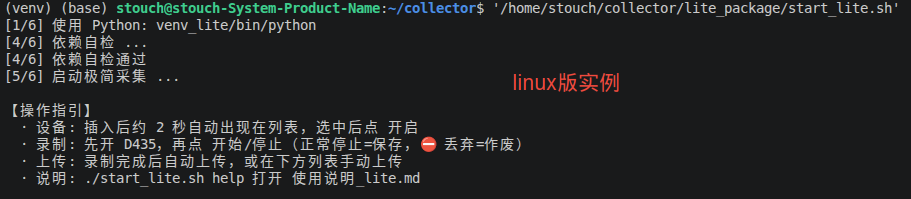

- Sub-commands: `reinstall`, `help`; offline: `pack_wheels.py --lite`.
- The **Linux** launcher additionally runs a 7-item gripper resource check (`[B]`) and refuses to start with `[Error B]` if the payload is missing; `KSQ_GRIPPER_SKIP_CHECK=1 ./start_lite.sh` skips it (gripper then just doesn't show up).
- **Data is shared**: Lite and main editions use the same `data/` folder — recordings made in Lite can be played back and uploaded in the main edition (see Appendix C).

<a id="en-ch2-8"></a>

## 2.8 Setup Failed?

1. **Read the end of the console output** — look for the `[Error X]` tag;
2. Look up the letter in [Appendix B.1](#en-app-b-1);
3. Fallbacks: re-download the zip (rules out corruption); `start.bat reinstall` (force reinstall).

> ↑ [Back to TOC](#en-toc)

<a id="en-ch3"></a>

# Chapter 3 The Interface (Main Edition)

This chapter introduces the program's look and every button. **All later chapters refer to buttons by the names defined here** — please skim it first.

<a id="en-ch3-1"></a>

## 3.1 Launch & Login

1. Start via `start.bat` or `run.bat`;
2. Before the main window, a **login dialog pops up**. ⚠️ Closing it exits the program;
3. The dialog contains:
   - **Server address**: default `http://127.0.0.1:8000` (a local demo server); use the address your admin provides (Chapter 4);
   - **Username / Password**: your assigned account;
   - **Remember account** (checked by default): remembers only the username, **never the password**;
   - **Guest login**: enter without credentials; you will only see public tasks (4.2);
4. After login, the main window appears.

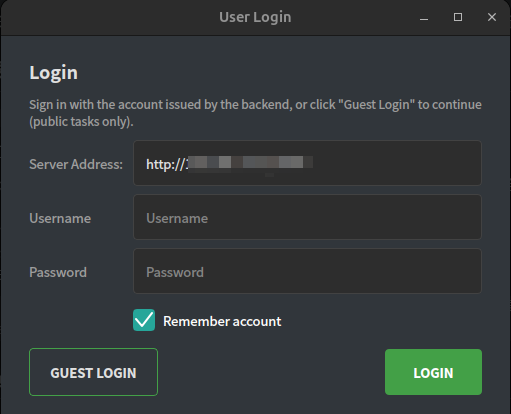

<a id="en-ch3-2"></a>

## 3.2 Main Window Overview

The 1600×900 main window is a **two-page switcher**:

**Page 1 — Task selection (shown at startup)**

Top: app name, server address & current identity, connection dot (● green = connected / gray = not, see 4.3); middle: task table; bottom: "Selected: xx" hint and "→ Enter Capture" / "🗑 Delete" buttons. Tasks are covered in Chapter 5.

**Page 2 — Capture page (after selecting a task)**

- **Center**: the camera grid — one tile per opened device. 1 stream fills the screen; 2 split left/right; 3 = two stacked left + one right; 4 = 2×2; more streams auto-arrange near-square. **Drag a tile's top info bar to swap positions; drag the splitter between tiles to resize.**
- **Menu bar**: File / View / Language / Help.
- **Toolbar row 1** (capture page only, left to right):

| Button | What it does | See |
|---|---|---|
| ← Back to Task Selection | Return to the task page | 7.4 |
| 🔍 Scan | Re-scan devices immediately (panel auto-scans every 2 s; this forces a refresh) | 6.7 |
| ⏺ Record All | Start recording on **all opened devices at once** | 7.1 |
| ⏹ Finish | Normal stop = **save** this episode | 7.2 |
| ⛔ Abort | Stop and **permanently delete all files of this episode** | 7.3 |
| ✕ Remove All | Close all device views | 6.7 |
| 📂 Playback | Open the playback dialog | 8.1 |
| ☁ Upload | Open the upload dialog | 8.4 |
| ☁ Auto Upload: On/Off | Toggle button, green = on; auto-uploads after each recording; **default on** | 8.5 |
| 🗑 Delete After Upload: On/Off | Toggle button: delete local files after a successful upload; **default off** | 8.5 |

- **Toolbar row 2 (hidden by default)**: hand-tracking tools (🧤 Glove Tracking / 🖐 Bare-Hand Tracking, ✋ Process Hand Keypoints, 📊 Auto Label) — an advanced labeling feature, briefly mentioned in Appendix D.

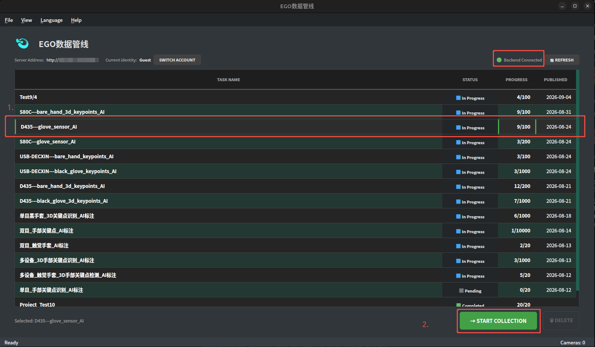

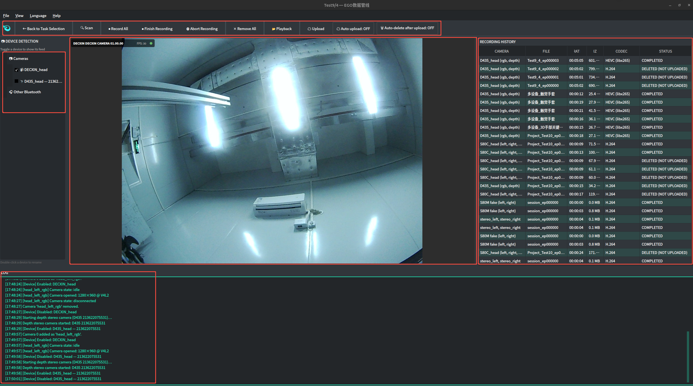

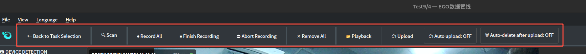

<a id="en-ch3-3"></a>

## 3.3 Dock Panels & Status Bar

| Panel | Position | Content |
|---|---|---|
| 📷 Devices | Left | Detected devices grouped (📷 Cameras / 🧤 Gloves / 🎧 Other Bluetooth), each with a check-toggle — **checking it shows the feed**. The star of Chapter 6 |
| Log | Bottom | Timestamped program log (recording, upload, hot-plug events), keeps up to 2000 lines |
| Recording History | Right | Latest 100 recordings: Camera | File | Duration | Size | Codec | Status |

All three panels can be **dragged, docked, or floated** (drag the title bar); close and reopen the program to restore the default layout.

**Status bar** (very bottom):

- Left: "Ready" when idle; red bold "⏱ H:MM:SS" live duration while recording;
- Right: constant "Cameras: N | Recording: 0" counter.

<a id="en-ch3-4"></a>

## 3.4 Switching Chinese / English

Menu **Language → 中文 / English**: the whole UI (menus, buttons, panels, dialogs, guide window) switches instantly.

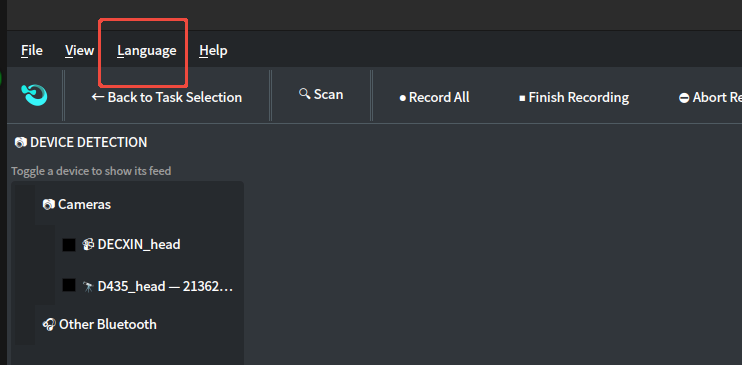

Note: the choice is **not saved** — the program restarts in Chinese. Switch it each time if you need English.

<a id="en-ch3-5"></a>

## 3.5 Quick-Start Guide Window

- First launch via `start.bat`/`start.sh` **pops up a "User Guide" window** with 5 steps: ① Login & server address → ② Connect devices → ③ Record → ④ Play back → ⑤ Upload;
- Check "Don't show again" at the bottom to suppress it;
- Reopen anytime via menu **Help → User Guide**.

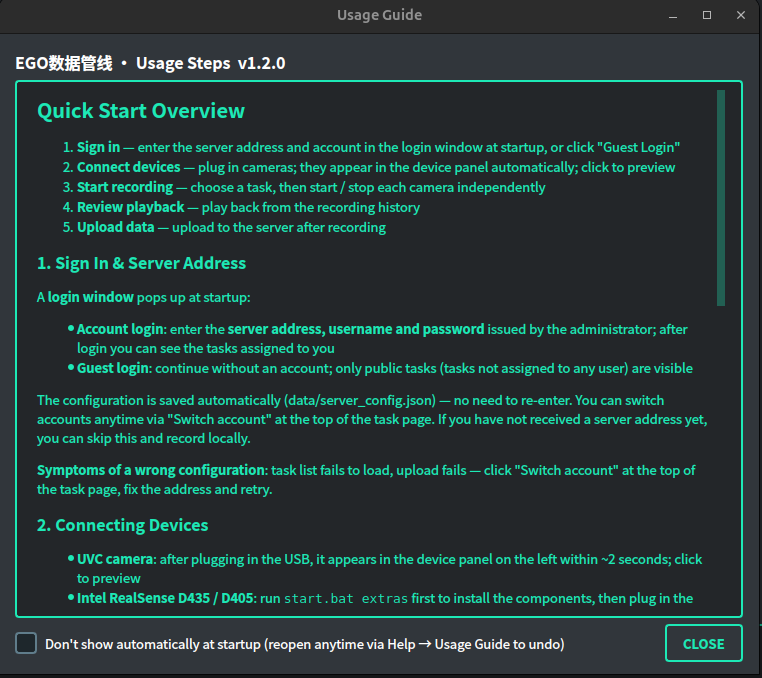

<a id="en-ch3-6"></a>

## 3.6 The Lite Edition

The Lite edition does exactly three things: **connect devices → record → upload**. No login, no task page, no playback. Window 980×640, title "DAQ 极简采集 (lite v1.2.0)". Top to bottom:

1. **Server row**: address field + "Test Connection" button + "Auto Upload" and "Delete After Upload" checkboxes;
2. **Left device area**: five groups (D435 Depth Camera / UVC Camera / USB-C Glove / BLE Glove / UMI Gripper, Linux package only), each a device dropdown + an "Open" button (becomes "Close"; the BLE Glove group has two rows, so you can connect the left and right gloves at the same time), plus a "Rescan" button;
3. **Right preview**: 640×360 feed at 15 fps; "Preview Source" dropdown switches RGB / Depth Heatmap / UVC RGB;
4. **Recording row**: task-name field (optional) + "▶ Start" (green) "■ Stop" (red) "⛔ Discard" (orange) + status text (Standby / ⏺ Recording HH:MM:SS);
5. **Upload row**: pending list ("task —— status (ep n)": Not Uploaded / Uploading / Uploaded / Failed) + "Upload Selected" / "Upload All Pending" + progress bar;
6. **Bottom log area**: read-only log.

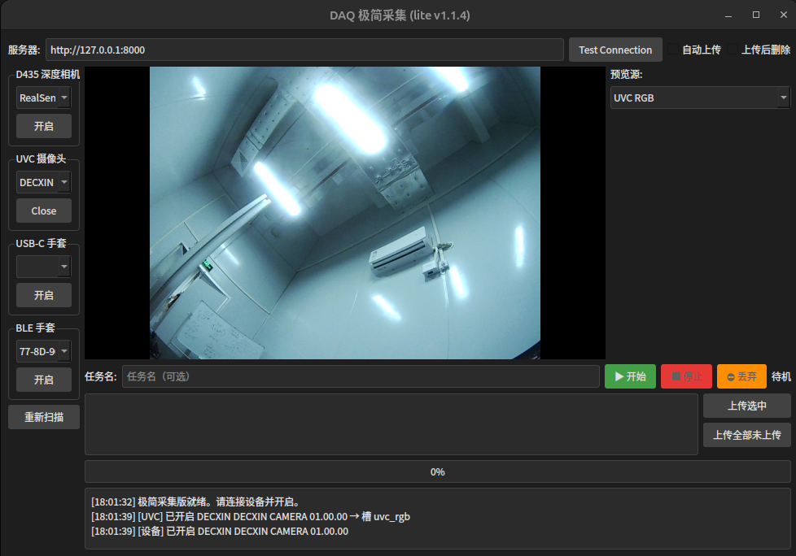

> ↑ [Back to TOC](#en-toc)

---

<a id="en-ch4"></a>

# Chapter 4 Connecting to the Backend Server

<a id="en-ch4-1"></a>

## 4.1 Server Address

- **Where**: the login dialog's "Server address" field (pops up at every start, 3.1); to change address or account later, use "Switch Account" on the task page;
- **Default**: `http://127.0.0.1:8000` — a **local demo server** that only works if a backend is running on this machine; get the real address from your admin;
- **Saved to**: `data/server_config.json` (address + upload preferences), auto-filled next start; you can also copy `data/server_config.example.json` to `server_config.json` and edit it.

<a id="en-ch4-2"></a>

## 4.2 Login & Credentials

| Method | Notes |
|---|---|
| Username + password | After login the program holds a session (cookie-based JWT); task polling and uploads carry it automatically |
| Remember account | Only saves the username; **the password is never written to disk** |
| Guest login | No credentials; **only public tasks** (those with no assigned user) |
| Server unreachable | You can still enter as guest and practice with 3 built-in sample tasks (5.3) |

<a id="en-ch4-3"></a>

## 4.3 Connection Status & Task Sync

- **Connection dot** at the top of the task page: **green = backend connected**, gray = not connected;
- **Auto sync**: the program polls the backend every **30 seconds** (`GET /api/v1/device/tasks?device_name=EGO_001`); new tasks appear automatically;
- **Works offline**: the list merges server data with a local cache (`data/tasks.json`); with no backend at all, 3 built-in sample tasks are available.

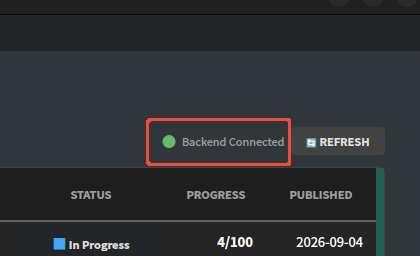

<a id="en-ch4-4"></a>

## 4.4 Expired Session & Switching Accounts

- **Session expired**: on a 401/403 the program prompts "Session expired, please log in again." and reopens the login dialog; closing it downgrades to guest mode;
- **Switch Account** (task page): change account, change server address, or toggle between account and guest — all through this button.

<a id="en-ch4-5"></a>

## 4.5 One Word for Admins

The collector only needs two things from you: a **server address + an account**. Tasks are pushed per device name `EGO_001`; uploads match projects by task name. Server-side deployment is out of scope here — see the backend project docs.

> ↑ [Back to TOC](#en-toc)

---

<a id="en-ch5"></a>

# Chapter 5 Viewing Project Tasks

<a id="en-ch5-1"></a>

## 5.1 Task List & Status Badges

The table has 4 columns: **Task Name | Status | Progress | Published**.

| Badge | Color | Meaning |
|---|---|---|
| Pending | Gray | No episodes collected yet (0) |
| In Progress | Blue | Partially collected |
| Completed | Green | Required episode count reached |

Progress shows `done/total` (e.g. `3/10` = 7 more to go). Sorted newest first.

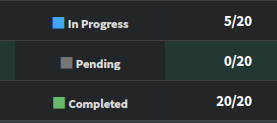

<a id="en-ch5-2"></a>

## 5.2 Selecting a Task

- **Single-click** selects a row: the bottom shows "Selected: <task name>";
- **Double-click** (or "→ Enter Capture"): opens the capture page; the window title becomes "<task name> — EGO数据管线"; every episode you record counts toward this task's progress;
- ⚠️ **Completed tasks are locked**: the enter button grays out with "This task is complete, please pick another" — protecting finished datasets.

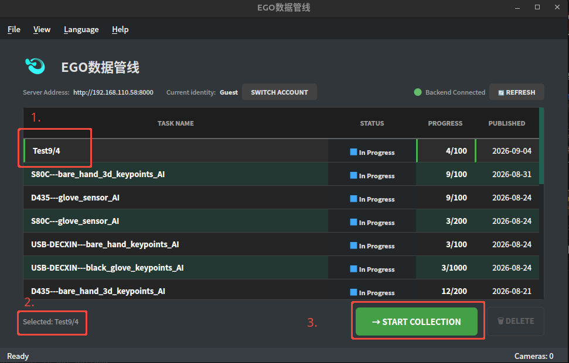

<a id="en-ch5-3"></a>

## 5.3 Refresh, Delete & Where Tasks Come From

| Action | Notes |
|---|---|
| 🔄 Refresh | Pulls tasks immediately (1.5 s debounce; auto-refreshes every 30 s anyway) |
| Right-click → Delete task | Removes it locally (hidden flag, recoverable in `data/tasks.json`); server-side tasks follow the server |
| Sources | Server push + local cache merge; 3 built-in samples (cylinder_grasping / cube_placement / valve_rotation) when no backend |

Each finished recording bumps the task progress by 1 and reports it to the server (progress is shared across machines).

> ↑ [Back to TOC](#en-toc)

<a id="en-ch6"></a>

# Chapter 6 Connecting Devices

<a id="en-ch6-0"></a>

## 6.0 Supported Devices at a Glance

One table, everything you can plug in. **The universal flow: plug in → wait ~2 s → check the toggle in the left 📷 Devices panel**:

| Device | Port | Max | Resolution / FPS | Special notes |
|---|---|---|---|---|
| UVC camera | USB | ≤ 8 | Linux 1280×960, Windows 1280×720, 30 fps (MJPG) | No driver needed |
| RealSense D435 / D405 | USB 3.0 | — | Depth 848×480 + RGB 1280×720, 30 fps | **Must run extras first** (pyrealsense2, 2.5) |
| Stereo S80C / S80M | USB 3.0 | 1 | Capture 50 fps → recorded at 30 fps | SDK built in; cannot run together with RealSense (6.3) |
| USB Type-C glove | USB serial (STM32 CDC) | 1 per hand | 16 IMU sensors + 16×16 tactile, rated 60 fps | No driver; 115200 baud |
| BLE glove | Bluetooth | 1 per hand | 16×16 tactile | PC Bluetooth on; broadcast name L/R picks the hand |
| UMI gripper (Fays S80M) | USB 3.0 + serial | 2 | Left-lens RGB + 10×10×3 force matrix + SLAM trajectory, 30 fps | **Linux only** (native stack is ELF); needs the 460 MB payload (see 2.7 and Appendix C) |

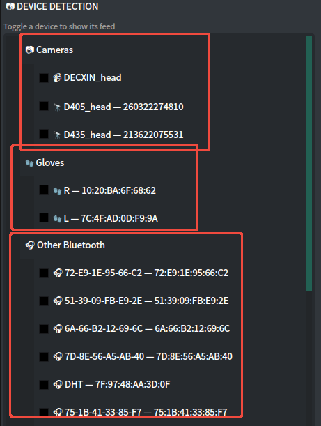

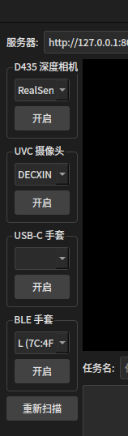

<a id="en-ch6-1"></a>

## 6.1 UVC Cameras

The everyday USB webcam.

- Appears in the 📷 Cameras group ~2 s after plugging in; **check the toggle to show the feed** (uncheck to close);
- Up to 8 cameras; each tile's info bar shows: device name + live FPS + status light (green=idle, red=recording, orange=error, gray=disconnected);
- "No signal" is shown when there is no feed;
- Hot-plug safe: unplugging **while recording does not abort** — the panel parks the device (log: "recording-time unplug, kept for auto-restore") and re-plugging restores it;
- Cameras occupied by WeChat/Teams etc. may show no feed — see [Appendix B.2](#en-app-b-2).

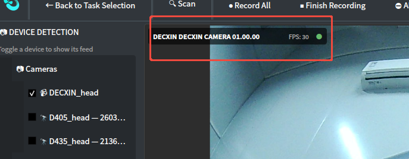

<a id="en-ch6-2"></a>

## 6.2 RealSense D435 / D405

Intel's depth camera — **color + distance in one device**.

- **Prerequisite**: run `start.bat extras` first (pyrealsense2), then plug the camera;
- Use a USB 3.0 port (blue). Opening it shows **two tiles**: RGB + depth heatmap (color = distance);
- D405 suits close-range capture; a built-in watchdog reconnects automatically after 5 s without frames;
- Conflicts with the stereo camera (6.3).

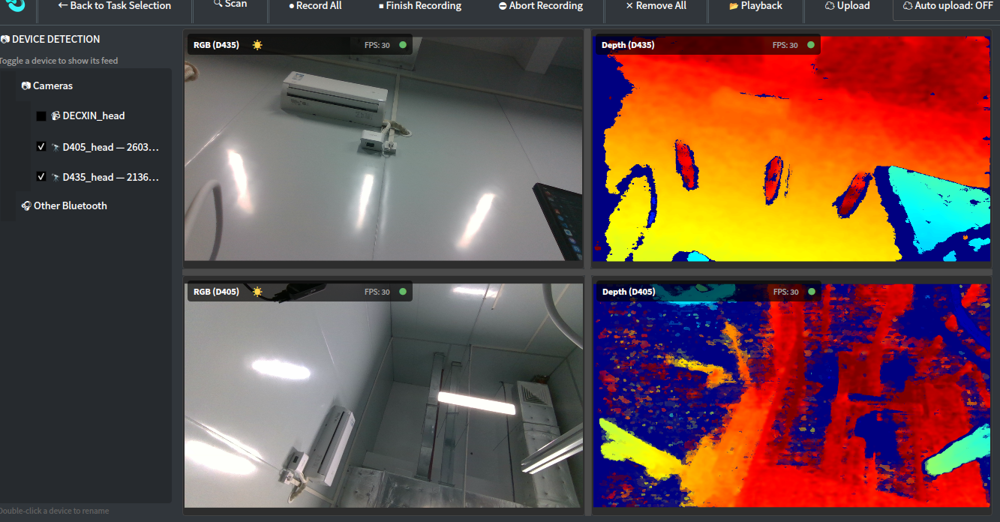

<a id="en-ch6-3"></a>

## 6.3 Stereo Cameras S80C / S80M

A dedicated two-lens camera, shown as FaysSense S80M in the panel.

- **No SDK install**: drivers ship inside the program;
- Opening it shows **three tiles**: left eye, right eye, live depth heatmap (computed disparity depth);
- Captures at 50 fps and **auto-decimates to 30 fps when recording** (keeps sync with other devices);
- ⚠️ **Cannot run together with RealSense** (shared system video nodes): a "device conflict" warning appears — close RealSense first;
- Occasional "[stereo warning] … empty-bucket rate …" log lines are fine (~3% is healthy, see 7.7).

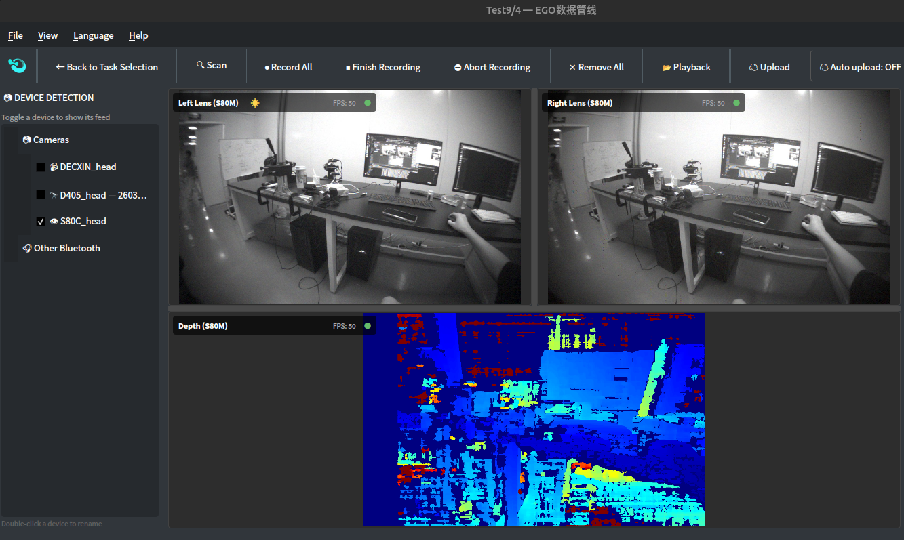

<a id="en-ch6-4"></a>

## 6.4 USB Type-C Glove

A glove with a tactile array and IMUs, connected by a Type-C data cable (STM32 serial, 115200 baud).

- **No driver**: it appears in the 🧤 Gloves group; checking it starts the data flow;
- Streams: **16 IMU sensors** (finger-pose quaternions) + **16×16 tactile array** (palm pressure), rated 60 fps;
- Left/right hand is **detected by serial number** (binding in `glove_devices.json` at the project root) — nothing to configure;
- The glove has no camera: data goes into the parquet files only (9.3).

<a id="en-ch6-5"></a>

## 6.5 BLE Glove

A wireless (Bluetooth) tactile glove.

- Order matters: **power the glove on first, then enable PC Bluetooth**;
- Broadcast names containing **L or R** map to left/right hand automatically; the glove appears within seconds; checking it connects;
- Auto-reconnect within 3 s of a disconnect;
- If it never appears: power-cycle the glove (see [Appendix B.2](#en-app-b-2)).

<a id="en-ch6-6"></a>

## 6.6 Hand-Side Binding & Device Names

- **Binding**: USB gloves bind by serial number (`glove_devices.json`); BLE gloves bind by MAC address (`data/device_names.json`). Bindings persist across sessions;
- **Double-click a device name to rename it** (e.g. "uvc1" → "head camera"); names persist;
- ⚠️ Names matter: they become video folder names and parquet column names (e.g. right-glove tactile data lives in `observation.right_glove`, 9.3). **Think before renaming** — already-recorded columns won't follow the rename.

<a id="en-ch6-7"></a>

## 6.7 Everyday Device Panel Operations

| Action | How | Notes |
|---|---|---|
| Open / close feed | Click the **check-toggle** | Check = open into the main grid |
| Rename device | **Double-click** its name | "Rename Device" dialog |
| Manual scan | Toolbar **🔍 Scan** | Panel auto-scans every 2 s; this forces an immediate rescan |
| Remove all | Toolbar **✕ Remove All** | Confirms "Remove all cameras?" |
| While recording | — | **Whole panel locked**: toggles and rename all disabled — data streams must not change mid-recording |

<a id="en-ch6-8"></a>

## 6.8 Device Not Detected?

Four checkpoints: **permissions → drivers → occupancy → ports**. Per-device fixes live in the [Appendix B.2](#en-app-b-2) table:

- Camera missing → check Windows privacy settings for desktop camera access;
- RealSense missing → did you run `start.bat extras`?
- Glove missing → check its power switch and PC Bluetooth;
- Feeds laggy → use a direct USB 3.0 port, remove hubs/extenders.

> ↑ [Back to TOC](#en-toc)

---

<a id="en-ch7"></a>

# Chapter 7 Live Recording

<a id="en-ch7-1"></a>

## 7.1 Starting a Recording

1. Select a task on the task page and double-click into the capture page;
2. Connect devices and open their feeds (Chapter 6);
3. Click **⏺ Record All**:

- **Every opened device records together** (since v1.2.0 recording is one global action — no per-camera start/stop);
- The program checks task progress first: **a full task is refused** — "Task progress is full (x/y), cannot start a new recording." Go back and pick another task;
- A background thread writes at an **exact 30 fps**, independent of the preview (a laggy preview does not hurt the recording);
- After starting: status bar turns red "⏱ H:MM:SS", right side shows "Recording: 1", the device panel locks, tile lights turn red, and the log prints "[slot] ▶ Recording started — codec: …".

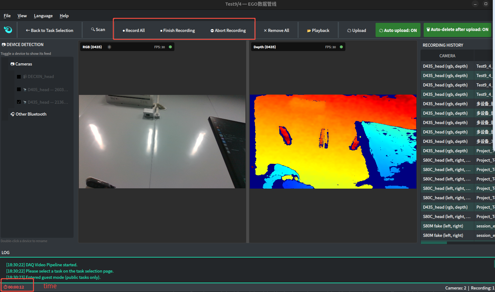

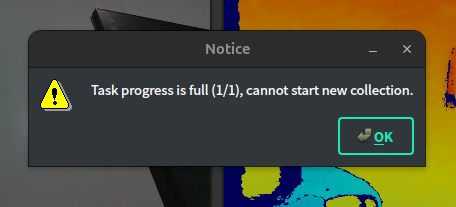

<a id="en-ch7-2"></a>

## 7.2 Finishing (Saving)

- Click **⏹ Finish** = normal stop = **save**;
- Everything lands on disk: per-stream videos + sensor parquet + metadata (structure in Chapter 9); the log prints the completion line and dropped-frame stats;
- After saving: the episode appears in the Recording History panel; task progress +1 and is reported to the server; if ☁ Auto Upload is on, the episode is queued automatically (8.5).

<a id="en-ch7-3"></a>

## 7.3 Aborting (Discarding)

- Click **⛔ Abort** = stop and **permanently delete every file of this episode** (tooltip: "Stop recording and permanently delete all files of this recording");
- The episode **number is recycled**: a marker is written to `meta/recycled_episode.json` and the next recording reuses that number — failed takes leave no junk and no gaps;
- **When to use**: "this take is garbage, redo." Use Abort rather than Finish so no half-files remain.

<a id="en-ch7-4"></a>

## 7.4 Interruptions While Recording

- Trying to leave the capture page ("← Back to Task Selection") or **closing the window** mid-recording: the program confirms — "Recording in progress. Leave the task list? The current recording will be aborted.";
- Confirming treats the episode as **aborted** (discard + recycle): **nothing is silently saved, no half-files remain**;
- Cancel keeps you recording.

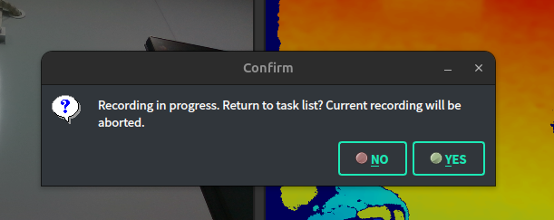

<a id="en-ch7-5"></a>

## 7.5 Live Parameters

| Location | Content | Notes |
|---|---|---|
| Tile info bar | Device name | e.g. RGB (D435), Left Lens (S80M) |
| Info bar | FPS: xx | Live frame rate |
| Info bar | Status light ● | green=idle / red=recording / orange=error / gray=disconnected |
| Info bar | Status text | "No signal" / "Waiting…" / "Disconnected" |
| Status bar left | ⏱ H:MM:SS | Live recording duration |
| Status bar right | Cameras: N \| Recording: 0/1 | Feed count & recording state |

Preview resolutions/fps per device: [6.0 overview](#en-ch6-0). Rearranging tiles (drag info bars, drag splitters) never affects what is recorded.

<a id="en-ch7-6"></a>

## 7.6 Video Encoding Options (important)

The program picks encoders automatically — you can ignore this and be fine. This section explains the rules and how to override.

**1) Default auto mode (recommended)**

At recording start the program probes this machine and takes the first option that works:

| Priority | Encoder | Params | Best for |
|---|---|---|---|
| 1 | hevc_nvenc (NVIDIA GPU hardware) | -cq 30 | Machines with NVIDIA GPUs — least CPU load |
| 2 | libx265 (software H.265/HEVC) | -crf 30, veryfast | Capable CPUs (must pass a speed test: ≥ 30 fps × 1.5) |
| 3 | libx264 (software H.264 fallback) | -crf 23, ultrafast | Low-end machines |

- H.265/HEVC keeps quality similar to H.264 at **about 1/10 the size**;
- The probe runs in the background (~1 s) without freezing the UI; the chosen codec is logged ("Recording started — codec: …").

**2) Manual override (rarely needed)**

Edit `RECORD_VIDEO_ENCODER` in `config/settings.py`:

```python
RECORD_VIDEO_ENCODER = "auto"   # default; or "nvenc" | "x265" | "x264"
```

An explicit value skips the speed gate and forces that encoder; if the machine can't do it, the program falls back along the chain and logs why.

**3) Depth videos are special**

Depth is not an ordinary video: millimeter depth values are encoded as **12-bit log grayscale** into HEVC MP4 (~42 KB/frame, ~4× smaller than lossless). If the machine's x265 lacks 12-bit support, it falls back to **lossless FFV1 MKV**. Always view depth through the in-app Playback (8.1) — a regular player just shows gray.

**4) Playback caveat (important)**

- ⚠️ **H.265/HEVC files won't play in the built-in Windows player** (no decoder):
  - Best: install the free **VLC** player;
  - Or install Microsoft Store's "HEVC Video Extensions" (paid);
  - Or set `RECORD_VIDEO_ENCODER` to `"x264"` — **only affects future recordings**; old files are unchanged;
- **In-app Playback always works**, regardless of system decoders.

<a id="en-ch7-7"></a>

## 7.7 Dropped Frames & Health Hints

After each recording the log prints drop stats. Two cases worth attention:

| Log message | Meaning | Fix |
|---|---|---|
| "[Warning] Recording dropped N frames — encoder may not keep up…" | Drops ≥ 30 frames or > 1% of total | Record fewer streams / lower resolution, or set the encoder to `"x264"` (fastest fallback) |
| "[stereo warning] Unstable frame delivery: empty-bucket rate xx% over 3 s" | Occasional decimation hiccup (healthy ≈ 3%) | Occasional = ignore; frequent = use a direct USB 3.0 port, avoid hubs/extenders |

Depth has its own **anti-drop mechanism** (repeats the last frame when one is missing) so depth frames stay 1:1 aligned with color frames — no manual action needed.

<a id="en-ch7-8"></a>

## 7.8 Recording in the Lite Edition

Three buttons, one straight flow:

1. Open at least one device first — **D435, UVC, or the UMI gripper (Linux) is mandatory**: gloves alone can't record (no video source; the program says "请先开启 D435 深度相机、UVC 摄像头或 UMI 夹爪。录制必须有视频源。"). A gripper-only setup records its left-lens RGB as the master video;
2. Task name field is optional (recordings fall under the default task);
3. **▶ Start** → status shows "⏺ Recording HH:MM:SS"; **■ Stop** = save; **⛔ Discard** = throw this take away;
4. Fixed Lite parameters: UVC records 640×480@30, preview 640×360@15 fps; **encoder fixed at H.264/x264** (no probe, low-end friendly);
5. Completion log looks like "[Recording] ■ Done: <dir> (N frames / dropped n / episode n)".

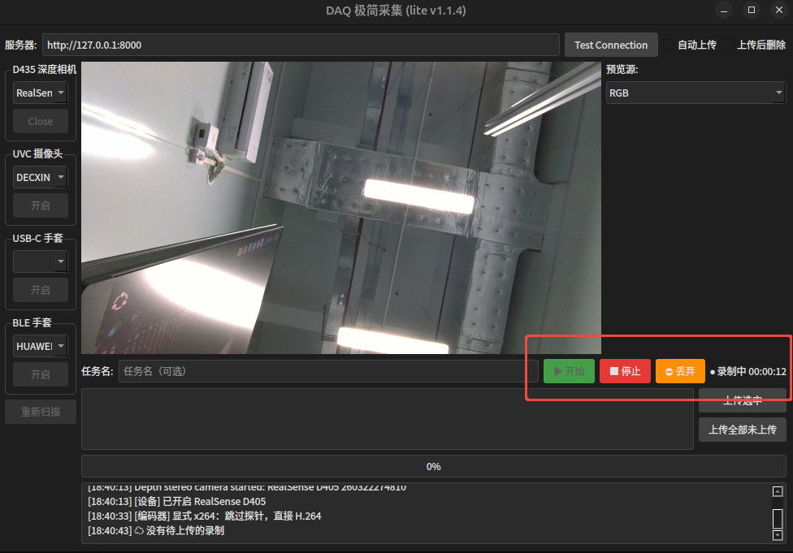

> ↑ [Back to TOC](#en-toc)

<a id="en-ch8"></a>

# Chapter 8 Playback, Upload, Delete

<a id="en-ch8-1"></a>

## 8.1 Opening Playback

Click toolbar **📂 Playback**:

- **Left**: a two-level tree — task folders → episodes (e.g. `episode-000`). Each episode carries an upload-state icon: **✅ uploaded (green disc, white check) / ❌ failed (red disc, white cross) / ⬜ not uploaded (gray outline)**;
- **Right**: the view grid. Selecting an episode loads every stream it was recorded with (cameras + sensors); the layout is draggable as usual;
- Top: "Recording dir:" shows the scanned data folder; "Choose Recording Dir" and "Refresh" let you point elsewhere or rescan.

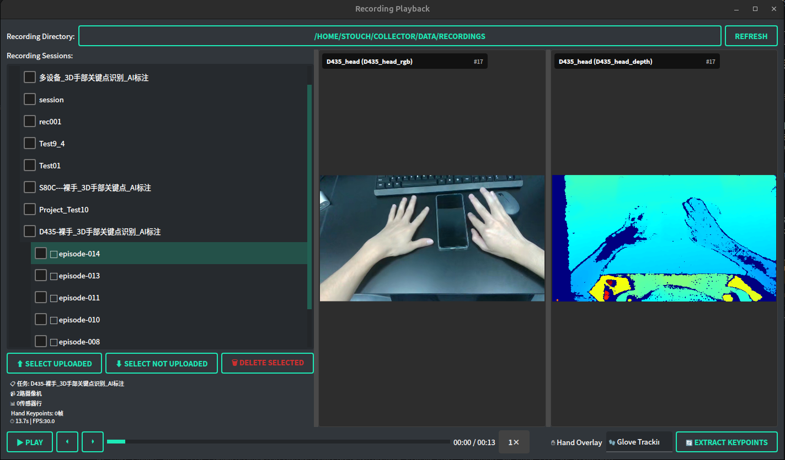

<a id="en-ch8-2"></a>

## 8.2 Playback Controls

| Control | Action | Notes |
|---|---|---|
| Play / pause | ▶ / ⏸ or Space | All streams play in sync |
| Speed | Click the speed button to cycle | 0.25× → 0.5× → 1× → 2× → 4× |
| Step frames | ← / → keys or the step buttons | One frame at a time; tile shows frame #N |
| Seek | **Click anywhere on the progress bar** | Jumps to that point (dragging only updates the time; release to seek) |
| Fullscreen | F11 | Toggle fullscreen |

<a id="en-ch8-4"></a>

## 8.4 Uploading

Click toolbar **☁ Upload**:

1. **Server config**: address (pre-filled from saved config) + "Test Connection" (success: "Server connection OK ✅") + "Target Project" dropdown (default "Auto (server matches by name)" — usually leave it; "Refresh Projects" fetches the server's project list);
2. **Session list**: "Select All", "Refresh", and filter buttons (⬆ only uploaded / ⬇ only not-uploaded) — each row shows task, duration, upload state;
3. **⬆ Upload All**: uploads one by one with "x/y" progress, ending with "✅ x/y uploaded: …" → "All done".

**Three mechanism notes** (useful when things go wrong):

- Each episode is zipped (videos already compressed — the zip doesn't re-compress) and POSTed to `/api/v1/session/upload`; a single large file may take up to 30 minutes;
- **Auto-retry 3 times** on failure; failed ones stay marked ❌ and can be re-uploaded anytime; local files are untouched;
- Non-HEVC videos are **pre-compressed to H.265 before upload** (~7% of original size); HEVC videos upload as-is. Upload states persist in `data/pipeline.db` across restarts.

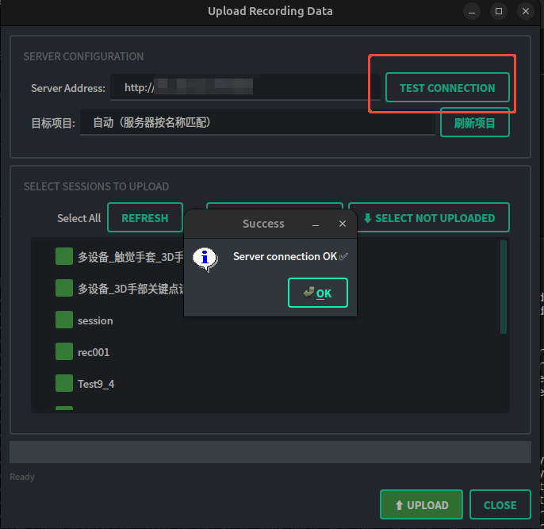

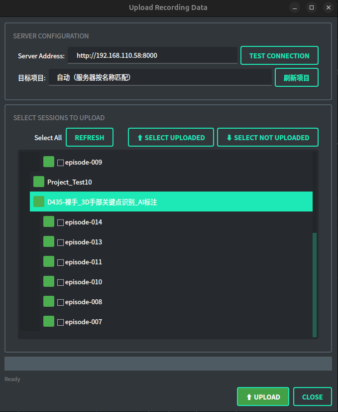

<a id="en-ch8-5"></a>

## 8.5 Auto-Upload & Auto-Delete

Two toggle buttons on the toolbar (click to toggle, green highlight = on):

| Toggle | Default | Effect |
|---|---|---|
| ☁ Auto Upload | **On** | Each finished recording is auto-queued for upload — no manual step |
| 🗑 Delete After Upload | **Off** | When on: local files are deleted after a successful upload ⚠️ the server then holds the **only copy** — enable with care |

Both toggles persist in `data/server_config.json` together with the server address.

<a id="en-ch8-6"></a>

## 8.6 Deleting Recordings

- **Entry**: the playback dialog's "🗑 Delete Selected" (check the episodes first);
- **Scope**: deletes that episode's **entire file set** (video + parquet + metadata row) — **local only, never the server**;
- **Confirmation**: "Permanently delete the following sessions? … This cannot be undone." — **no recycle bin**;
- Deleting an uploaded episode marks it "uploaded, locally deleted"; for un-uploaded ones, make sure the server has a copy first.

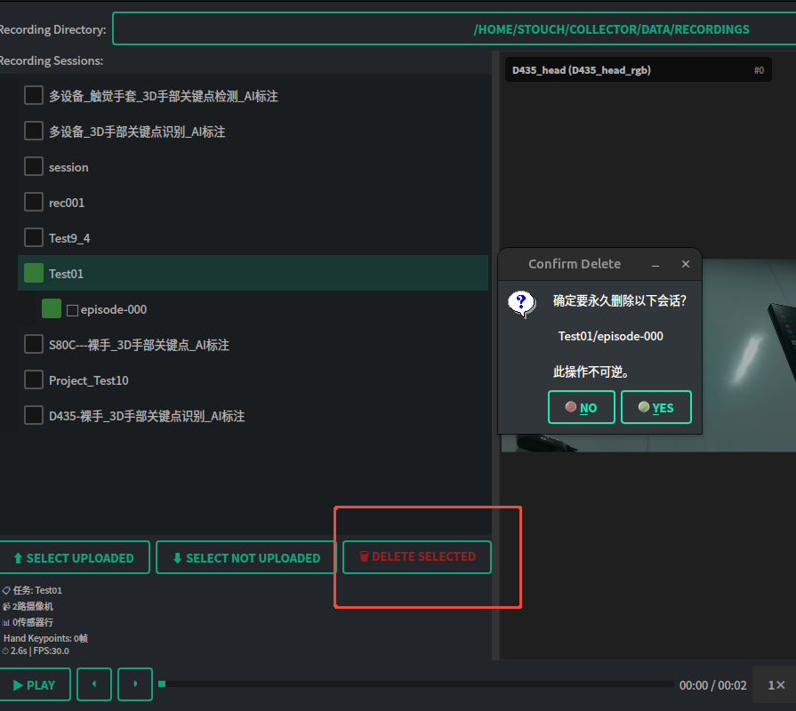

<a id="en-ch8-7"></a>

## 8.7 Uploading from the Lite Edition

- Uploading is built into the Lite main window: fill the server address at the top → "Test Connection" → "Upload Selected" or "Upload All Pending" below, with a progress bar;
- List entries: "task —— state (ep n)" with states Not Uploaded / Uploading / Uploaded / Failed;
- **Interoperable with the main edition**: both share `data/pipeline.db` — episodes recorded in Lite appear in the main edition's ☁ Upload dialog too, and main-edition auto-upload applies to them as well.

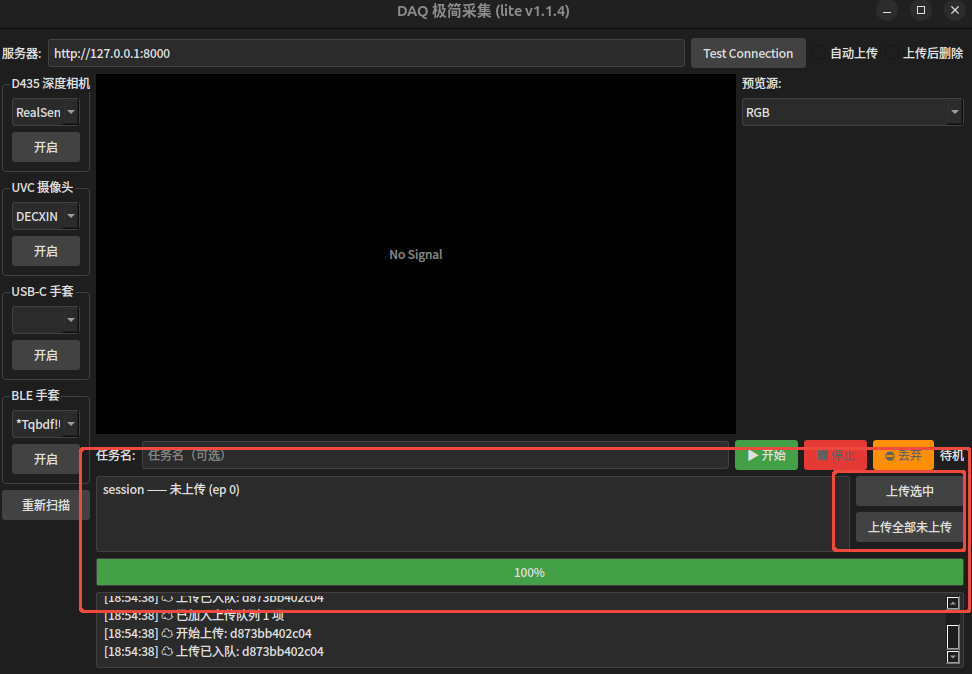

> ↑ [Back to TOC](#en-toc)

---

<a id="en-ch9"></a>

# Chapter 9 The Data Structure on Disk

<a id="en-ch9-1"></a>

## 9.1 Overview & Numbering

Everything lives under **`data/recordings/<task name>/`** (task names are sanitized to letters/digits/underscores; recordings without a task go under `session`). Each task folder holds **three trees**:

```
data/recordings/<task name>/
├── videos/                      # ① video files (one per stream)
│   └── chunk-000/<slot name>/episode-000.mp4
├── data/                        # ② sensor data (one parquet per episode)
│   └── chunk-000/episode-000.parquet
└── meta/                        # ③ metadata (task-level + episode-level)
    ├── info.json                # task-level: format/fps/cameras/column schema
    ├── stats.json               # task-level statistics
    ├── tasks.jsonl              # task info (server relies on it)
    ├── recycled_episode.json    # abort-recycling marker (runtime file)
    └── episodes/chunk-000/episode-000.parquet   # one row per episode
```

**Numbering rules** (important):

- Each recording = one **episode**, numbered from 1 within the task;
- File names start at **`episode-000` (= episode 1)**: names are 0-based — `episode-001` is the 2nd episode;
- Every 1000 episodes roll into a new `chunk-000`, `chunk-001`, …;
- **Aborted** episodes (7.3) **take no number**: the number is recycled for the next take;
- **Completed episode numbers are never reused**, even after deleting the files.

**Backup = copy the whole `data/` folder** (all recordings + local config).

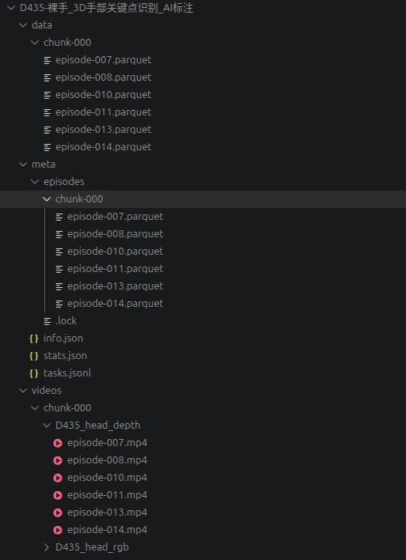

<a id="en-ch9-2"></a>

## 9.2 videos/ — Video Files

`videos/chunk-NNN/<slot name>/episode-NNN.mp4` — **one file per stream per episode**.

- **RGB video**: `.mp4`, H.265/HEVC or H.264 (per the 7.6 choice), 30 fps;
- **Depth video**: `.mp4` (12-bit log grayscale HEVC) or `.mkv` (lossless FFV1 fallback) — an encoding of distance; only in-app Playback renders it as a proper heatmap;
- **Slot name = device name**, common ones:

| Slot | Device |
|---|---|
| `head_left_rgb` / `head_right_rgb` | UVC camera #1 / #2 |
| `d435_rgb` / `D435_head_depth` | RealSense D435 color / depth |
| `stereo_left` / `stereo_right` | Stereo camera left / right |
| `stereo_depth` | Stereo disparity depth |
| `gripper_rgb` (`gripper_2_rgb` for the 2nd gripper) | UMI gripper left lens (recorded whenever a gripper is open — in the Lite edition this is the only gripper video) |

<a id="en-ch9-3"></a>

## 9.3 data/ — Sensor Parquet

`data/chunk-NNN/episode-NNN.parquet` — **one file per episode** (zstd-compressed; openable with pandas/pyarrow).

**One row = one frame** (30 fps; a 485-row episode ≈ 16 s). Columns fall into four groups:

**① Frame keys**

| Column | Meaning |
|---|---|
| `episode_index` | Global episode number |
| `frame_index` | Frame number (from 0 within the episode) |
| `timestamp` | Seconds since episode start (float) |
| `task_index` | Task number |
| `wall_time` | Absolute Unix timestamp |
| `hardware_ns` | Hardware timestamp in nanoseconds (stereo devices; same clock as the IMU) |

**② Observations (`observation.*`, columns exist only when data exists)**

| Column | Meaning |
|---|---|
| `observation.<sensor name>` | **Tactile array**: 16×16 flattened to 256 float32 (e.g. `observation.right_glove`) |
| `observation.imu` | Stereo camera IMU: 6 axes (gx,gy,gz,ax,ay,az) variable-length list |
| `observation.<sn>_imu_quat` | USB glove IMU: 16 sensors × 4-component quaternion = 64 dims |
| `observation.<sn>_imu_valid` | Validity flags for those 16 sensors (16 dims) |
| `observation.left_hand_pose` / `observation.right_hand_pose` | Hand keypoints: **63 dims = 21 points × 3 coordinates (meters)**; zeros when not solved (placeholder column) |
| `observation.gripper_left_force` / `_right_force` | **UMI gripper contact force** `[fx, fy, fz]` in mN (3 dims); the twin column `…_force_ns` carries that sample's capture time (ns, monotonic) |
| `observation.gripper_left_force_matrix` / `_right_force_matrix` | **Force matrix**, 10×10×3 = 300 values, integer-encoded — the multiplier is per-recording, read `features["observation.…_force_matrix"].scale` in `meta/info.json` (default ×100); twin column `…_force_matrix_ns` = capture time (ns) |
| `observation.gripper_state` | Gripper state `[open %, gripped flag, fz mN]` (3 dims) |
| `observation.slam_trajectory` | **Gripper SLAM trajectory** (variable length): 8 values per point `[t, x, y, z, qx, qy, qz, qw]` — position in meters in the post-origin frame, quaternion, `t` monotonic in seconds |

> The force/matrix `_ns` columns exist because forces are sampled latest-wins while RGB takes the oldest queued frame, so row numbers alone drift apart within a take; resample by those timestamps to align modalities.
> With a **second gripper**, every one of its columns gets the `gripper_2_` prefix (e.g. `observation.gripper_2_gripper_left_force`), so two grippers never collide.

**③ Action & status**

| Column | Meaning |
|---|---|
| `action` | Action placeholder (1-dim float) |
| `status.<device name>` | Connection state ("connected"/"disconnected") |

> Example: a "D435 + right glove" recording has columns `episode_index … wall_time, observation.right_glove(256), observation.right_glove_imu_quat(64), observation.right_glove_imu_valid(16), observation.right_hand_pose(63), action, status.right_glove`.

<a id="en-ch9-4"></a>

## 9.4 meta/ — Metadata

| File | Content | For |
|---|---|---|
| `info.json` | Task-level "spec sheet": `format` (`pooled_episodes_v1`), `fps=30`, `cameras` (per-stream resolution), `features` (dtype/shape of every column), `calibration`, `app_version`, etc. | Programs reading the data |
| `stats.json` | Task-level statistics accumulator (count/mean/std/min/max per column) | Data analysis |
| `tasks.jsonl` | One JSON line: `{"task_index":0, "task":"<task name>"}` — **the server identifies the task from this file** | Server |
| `episodes/chunk-NNN/episode-NNN.parquet` | **One row per episode**: `episode_index / task_index / start_frame_index / end_frame_index / length / duration_sec / drop_stats / video_codec / calibration` | Playback & pipelines |
| `recycled_episode.json` | Number-recycling marks from aborts (runtime-maintained, 7.3) | Program internal |

⚠️ **Never hand-edit anything under meta/** — playback and upload rely on it matching the videos/parquet exactly.

<a id="en-ch9-5"></a>

## 9.5 Other Local Files

Besides recordings, `data/` holds a few small program files:

| File | Content | Notes |
|---|---|---|
| `data/pipeline.db` | Recording history + upload queue (SQLite) | Deleting it loses all history & upload states |
| `data/server_config.json` | Server address, remembered username, upload prefs | Contains account info — **don't share**; a template is at `server_config.example.json` |
| `data/device_names.json` | Device renames, BLE glove MAC → hand binding | — |
| `data/device_params.json` | Per-device exposure settings | — |
| `data/tasks.json` | Task cache (merged with server) | — |
| project root `glove_devices.json` | USB glove serial → hand binding | Factory config, don't touch |
| project root `keypoints_output/` | Hand-keypoint post-processing outputs (🔄 Extract / Auto Label) | Kept separate; never written back into recordings |

<a id="en-ch9-6"></a>

## 9.6 What the Data Is Good For

- The layout is an **EgoData / LeRobot v3-compatible** multimodal dataset: video + tactile + pose + IMU aligned per frame — ready for robot teleoperation training, behavior cloning, and similar downstream pipelines;
- To quickly *look at* one episode: use the **single-file viewer** `tools/demos/pooled_viewer_demo/pooled_viewer_demo.py` (copy it plus the data to a colleague; see Appendix D.2);
- To read the data programmatically: read `meta/info.json` first for the column schema, then load the parquet with pandas (columns explained in 9.3).

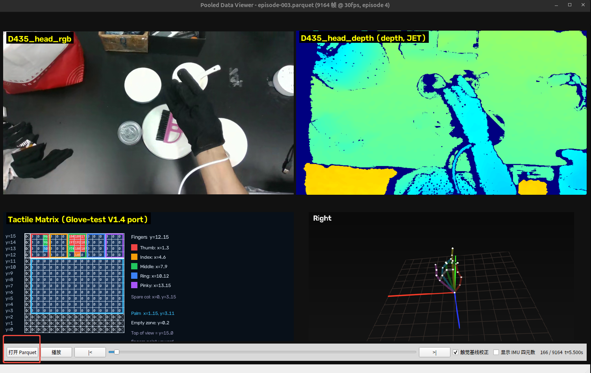

> ↑ [Back to TOC](#en-toc)

<a id="en-app-a"></a>

# Appendix A Image Insertion Checklist

**All images are embedded in the text**: the table below is the complete figure list for reference (files live in `docs/images/`).

| No. | Section | Shoot (screen + state) | File | Edition | Size |
|---|---|---|---|---|---|
| 1-1 | 1.1 | GitHub repo page ("Code → Download ZIP" highlighted) | `docs/images/fig-1-1.png` | General | 1600×900 |
| 2-1 | 2.2 | start.bat six-step output just before launch | `docs/images/fig-2-1.png` | Main | 1000×600 |
| 2-2 | 2.7 | start_lite.bat output | `docs/images/fig-2-2.png` | Lite | 1000×600 |
| 3-1 | 3.1 | Login dialog (address + account filled, "Remember" checked) | `docs/images/fig-3-1.png` | Main | native |
| 3-2 | 3.2 | Task page (data in list, ● green, "Selected" area) | `docs/images/fig-3-2.png` | Main | 1600×900 |
| 3-3 | 3.2 | Capture page (one UVC open, all panels expanded) | `docs/images/fig-3-3.png` | Main | 1600×900 |
| 3-4 | 3.2 | Toolbar row 1 close-up (10 buttons, toggle states) | `docs/images/fig-3-4.png` | Main | 1200×120 |
| 3-5 | 3.4 | Language menu expanded | `docs/images/fig-3-5.png` | Main | 400×300 |
| 3-6 | 3.5 | Quick-start guide window | `docs/images/fig-3-6.png` | Main | 900×700 |
| 3-7 | 3.6 | Lite main window overall | `docs/images/fig-3-7.png` | Lite | 980×640 |
| 4-1 | 4.3 | Connection dot ● green close-up | `docs/images/fig-4-1.png` | Main | 300×150 |
| 5-1 | 5.1 | Task list with all three badges (gray/blue/green) | `docs/images/fig-5-1.png` | Main | 1200×300 |
| 5-2 | 5.2 | Task selected ("Selected: xx" highlighted) | `docs/images/fig-5-2.png` | Main | 800×450 |
| 6-1 | 6.0/6.7 | Devices panel (camera + glove groups with toggles) | `docs/images/fig-6-1.png` | Main | 400×900 |
| 6-2 | 6.1 | One UVC tile (info bar: name/FPS/light) | `docs/images/fig-6-2.png` | Main | 800×450 |
| 6-3 | 6.2 | D435 two tiles (RGB + depth heatmap) | `docs/images/fig-6-3.png` | Main | 1200×450 |
| 6-4 | 6.3 | Stereo three tiles (left/right/depth) | `docs/images/fig-6-4.png` | Main | 1400×450 |
| 6-6 | 6.0 | Lite device area close-up (five dropdowns + buttons; the UMI Gripper group appears on Linux packages only) | `docs/images/fig-6-6.png` | Lite | 400×300 |
| 7-1 | 7.1/7.2 | Recording in progress (⏱ timer, "Recording: 1", locked panel) | `docs/images/fig-7-1.png` | Main | 1600×900 |
| 7-2 | 7.1 | Progress-full refusal dialog | `docs/images/fig-7-2.png` | Main | native |
| 7-3 | 7.4 | Leave-confirmation dialog while recording | `docs/images/fig-7-3.png` | Main | native |
| 7-4 | 7.8 | Lite recording (⏺ timer, ⛔ Discard visible) | `docs/images/fig-7-4.png` | Lite | 980×640 |
| 8-1 | 8.1/8.2 | Playback dialog (tree with upload icons + grid + controls) | `docs/images/fig-8-1.png` | Main | 1400×800 |
| 8-3 | 8.4 | Upload dialog (address filled, connection OK, filters) | `docs/images/fig-8-3.png` | Main | 1200×800 |
| 8-4 | 8.4 | Upload progress "x/y" | `docs/images/fig-8-4.png` | Main | 1200×800 |
| 8-5 | 8.6 | Delete confirmation dialog | `docs/images/fig-8-5.png` | Main | native |
| 8-6 | 8.7 | Lite pending list + progress bar | `docs/images/fig-8-6.png` | Lite | 980×640 |
| 9-1 | 9.1 | File manager showing a real task folder's three trees | `docs/images/fig-9-1.png` | General | 1200×800 |
| 9-2 | 9.6 | pooled_viewer_demo on one episode (RGB+depth+tactile) | `docs/images/fig-9-2.png` | Main | 1400×800 |

> ↑ [Back to TOC](#en-toc)

---

<a id="en-app-b"></a>

# Appendix B Error Codes & Troubleshooting

> Identical to 使用说明_EN.md §4 and the `[Error X]` tags printed by start.bat. The Chinese half carries the same tables; English summaries below.

<a id="en-app-b-1"></a>

## B.1 Error Code Table (as printed by start.bat)

| Code | Symptom | Solution |
|---|---|---|
| **A** | Python not found / auto-install failed | ① Offline: put `python-3.12.10-amd64.exe` into `wheels/` and retry; ② Install Python 3.12.x 64-bit manually, tick **Add python.exe to PATH**; ③ A Microsoft Store Python may interfere — uninstall it, install the official one; ④ Python < 3.10 counts as missing |
| **B** | *(Lite edition on Linux only)* "夹爪原生资源缺失" — the gripper native payload is missing | The Linux Lite package ships the UMI gripper payload (`core/gripper/native/` ~460 MB + `core/gripper/sightac_sdk/`) as a **required** resource; the launcher checks 7 items up front and refuses to start (so you don't sit through a wheel install first). The message lists exactly which items are missing. ① Re-extract the full package (most common cause: one directory level short, or an upgrade that copied code but not the payload); ② Only need D435/UVC/gloves → `KSQ_GRIPPER_SKIP_CHECK=1 ./start_lite.sh` (the gripper group then stays empty); ③ Custom install location → point `KSQ_GRIPPER_NATIVE_ROOT` at the payload |
| **C** | venv creation failed | ① Free disk space (needs ~2 GB); ② Antivirus blocked it → whitelist the folder, then `start.bat reinstall`; ③ Path too long → move to a short path like `C:\collector`; ④ Special characters in path → use a plain-English folder |
| **C2** | Old venv deletion failed | The main program is still running — close its window, then `start.bat reinstall` |
| **D** | Dependency download/install failed | ① Check the network and rerun (partial downloads are cached); ② Corporate firewall → ask admin to allow PyPI mirrors or use the offline route (2.6); ③ Antivirus blocking pip → whitelist; ④ Repeated failures → `start.bat reinstall` |
| **E** | Dependency self-check failed | ① Antivirus quarantined venv files → restore + whitelist; ② `start.bat reinstall`; ③ In cmd run `venv\Scripts\python.exe -c "import main"` for the real error |
| **F** | Program exited right after start | ① Update GPU drivers; ② Remote desktop / VM → run on real hardware; ③ Qt platform plugin error → `start.bat reinstall`; ④ No camera feed → Windows "Settings-Privacy & security-Camera" allow desktop apps; ⑤ Run `venv\Scripts\python.exe main.py` in cmd for the real error |
| **G** | "main.py not found" | Wrong extraction level: go into the inner folder where `start.bat` and `main.py` sit together |

<a id="en-app-b-2"></a>

## B.2 Camera / Device Issues

| Symptom | Solution |
|---|---|
| Camera missing from panel | ① Windows camera privacy: allow desktop apps; ② Check Device Manager drivers; ③ Close apps occupying the camera (WeChat, Teams…); ④ Try another USB port (direct/3.0 preferred) |
| Stereo (S80C) and RealSense can't run together | Hardware limitation: close RealSense first, then open the stereo camera |
| Gloves don't appear | Glove powered on? PC Bluetooth on? Wait a few seconds; power-cycle the glove |
| Feed laggy / low FPS | Use USB 3.0 ports; avoid hubs and extension cables; close other camera apps |
| RealSense not detected | Run `start.bat extras` first, then re-plug |
| Corrupted recordings / dropped frames | Avoid plugging/unplugging while recording; wait a moment after stopping before quitting |

<a id="en-app-b-3"></a>

## B.3 Upload Issues

| Symptom | Solution |
|---|---|
| Upload failed / timeout | Check network and server reachability; verify the address in `data/server_config.json` (first use: copy `server_config.example.json` and rename) |
| Upload says success but server shows nothing | Ask the admin to check the server import log (silent batch-import failures) — provide the session and task names |
| Large uploads are slow | Normal — big recordings take a while; be patient |

<a id="en-app-b-4"></a>

## B.4 Other Issues

| Symptom | Solution |
|---|---|
| SmartScreen blocks start.bat | Normal download marking: "More info" → "Run anyway", or unblock in file properties |
| Garbled Chinese in the console | `start.bat` is GBK-encoded: don't re-save it with Notepad/VSCode; re-download the original |
| Antivirus flags the installer | One-click setup downloads and silently installs Python — expected; whitelist the project folder |
| Disk full | Free space; recordings grow over time (Chapter 9) |
| Recorded videos won't play in Windows player | Default H.265/HEVC — Windows lacks the decoder. **Best: install free VLC** (in-app Playback also works); or install "HEVC Video Extensions" from the Microsoft Store; or set `RECORD_VIDEO_ENCODER = "x264"` in `config/settings.py` (only affects new recordings) |
| "Encoder may not keep up" after recording | Machine too slow: record fewer streams / lower resolution, or set `RECORD_VIDEO_ENCODER = "x264"` (fastest fallback) |

> ↑ [Back to TOC](#en-toc)

---

<a id="en-app-c"></a>

# Appendix C Lite vs. Main Comparison

Not sure which edition to use? This table settles it:

| Feature | Main edition (main.py) | Lite edition (main_lite.py) |
|---|---|---|
| Purpose | Full capture workbench | Just "connect devices → record → upload" |
| Login / task page | Yes (login required; task list, progress, badges) | No (task name typed manually, optional) |
| Playback | Yes (full playback dialog) | No (data can be played back in the main edition) |
| Quick-start guide | Yes (pops on first launch) | No |
| Hand skeleton solving | Yes (MANO 21 keypoints filled live) | No (columns stay zero — valid) |
| Theme | qt-material dark theme | Lightweight dark style |
| Devices | UVC ≤ 8 + D435 + stereo S80C/S80M + gloves + UMI gripper (Linux) | One of each: D435 / UVC / USB-C glove; BLE gloves 2 (left + right at once); UMI grippers up to 2 (Linux package only) |
| Gripper (UMI / Fays S80M) | Full visualization (stereo tiles, force-matrix heatmaps, pose view, open/close panel) | **Records without any visualization** — RGB video + force/tactile/matrix + SLAM trajectory are written to disk, nothing is shown; no "re-read factory calibration" context menu (use `tools/import_gripper_calibration.py --generate` instead) |
| Gripper payload (~460 MB) | Ships in the repo (`core/gripper/native/`, not in git) | Ships in the **Linux** package (required; `[Error B]` if missing) — the **Windows** package carries the gripper code but no payload, so its gripper group stays empty there |
| UVC recording | Linux 1280×960, Windows 1280×720 @30 | Fixed 640×480 @30 |
| Preview | Full res, capped 30 fps | 640×360 @15 fps |
| Encoder | Auto probe (nvenc → x265 → x264) | Fixed x264 (low-end friendly) |
| Dependencies | 15 packages (+ optional extras/torch) | 9 packages (incl. pyrealsense2) |
| Virtual env | `venv/` | `venv_lite/` (independent) |
| Data sharing | Shared `data/`: Lite recordings play back & upload in the main edition | Same |

**How to choose**: regular operators with task management → main edition; low-end machines, simple capture+upload only → Lite. Both can be installed and used side by side.

> ↑ [Back to TOC](#en-toc)

---

<a id="en-app-d"></a>

# Appendix D Toolchain (Brief)

> These tools target annotation / QA / algorithm engineers; everyday operators can skip this appendix. Full install & parameters live in each tool's own 使用说明.md.

<a id="en-app-d-1"></a>

## D.1 tools/glove_package: Black-Glove Recognition Demo

Hand recognition for dark gloves (MediaPipe fails on black gloves; this uses a YOLO-World detector + RTMPose for 21 keypoints):

- **Live demo**: `hand_demo_mmpose.py` — real-time finger/joint recognition; keys: `c` snapshot, `r` continuous capture, `m` save only missed-detection frames, `q/ESC` quit;
- Output: `captures1/<timestamp>/{session.json, frames/*.jpg, labels.jsonl}` (21 keypoints + bbox pre-labels per frame);
- `infer.py`: batch inference on image folders / video files;
- ⚠️ First run downloads models (~450 MB, needs internet); details in `tools/glove_package/使用说明.md`.

<a id="en-app-d-2"></a>

## D.2 tools/demos/pooled_viewer_demo: Single-File Viewer

`pooled_viewer_demo.py` — a **single Python file** viewer (needs only numpy/pyarrow/opencv-python/PyQt5), independent of the whole program:

- Opens one episode: `venv/bin/python tools/demos/pooled_viewer_demo/pooled_viewer_demo.py [episode-NNN.parquet]`;
- Shows: D435 RGB + depth side by side (frame-aligned), glove tactile panel (16×16 grid + hand-shaped heatmap), MANO skeleton panel, glove IMU panel (toggleable);
- Keys: Space play/pause, ←/→ step, drag the slider to seek;
- Copy the file + parquet + videos to a colleague — they install three packages and review the data.

<a id="en-app-d-3"></a>

## D.3 tools/hand_3d_s80c: S80C Hand Demo

Real-time 3D hand-keypoint demo for the S80C stereo camera (`run_live_s80c.sh`, `--glove` black-glove mode). SDK ships with the repo — nothing to install.

> ↑ [Back to TOC](#en-toc)

---

<a id="en-app-e"></a>

# Appendix E Document Index & Support

| Document | Role |
|---|---|
| **使用手册.md (this file)** | Detailed bilingual operations manual for end users |
| 使用说明.md / 使用说明_EN.md | Quick guide + error-code reference (opened by `start.bat help`) |
| README.md | Repo overview & dev info (hardware table, changelog) |
| docs/ (ui.md, data.md, file_format.md …) | Implementation details, advanced reading |
| 使用说明_lite.md | Lite edition quick guide & acceptance checklist |
| tools/glove_package/使用说明.md | Glove toolchain details |

**When reporting a problem**, include these three things to speed things up:

1. Screenshot of the error (including the `[Error X]` tag at the end of the console, if any);
2. Steps you took (what you did, which step failed);
3. Full output: run `venv\Scripts\python.exe main.py` in cmd (Linux: `venv/bin/python main.py`) and paste the complete error text.

> ↑ [Back to TOC](#en-toc)


<a id="part-cn"></a>

# 中文完整版

> **读者说明（先读这 4 条）**
> 1. **与《使用说明.md》的关系**：本手册是详细操作版；《使用说明.md》是快速指引 + 错误码速查表（`start.bat help` 打开的就是它）。两者并存，报错时按本手册附录 B 查即可，内容与《使用说明.md》第 4 节一致。
> 2. **插图说明**：正文插图已全部嵌入（文件位于 `docs/images/` 目录，编号见「附录 A 插图清单」）。中英文两个半区共用同一张图片文件。
> 3. **本手册适用于 v1.2.0**：界面文案、目录结构均以 v1.2.0 代码为准。旧版《使用说明.md》中「每路相机独立开始/停止录制」的描述在 v1.2.0 已改为工具栏统一录制（见 7.1），以本手册为准。
> 4. **界面语言**：本手册按中文界面撰写，关键按钮后括号标注英文界面文字（如「⏺ 全部录制 / Record All」）。


<a id="cn-toc"></a>

## 目录

**第 1 章 下载代码（开源地址）**
- [1.1 获取渠道](#cn-ch1-1) ｜ [1.2 下载与解压](#cn-ch1-2) ｜ [1.3 目录速览](#cn-ch1-3) ｜ [1.4 版本与许可证](#cn-ch1-4)

**第 2 章 一键部署（不同电脑环境与需求）**
- [2.1 部署前的环境检查](#cn-ch2-1) ｜ [2.2 Windows 一键部署：双击 start.bat](#cn-ch2-2) ｜ [2.3 Linux 一键部署：./start.sh](#cn-ch2-3) ｜ [2.4 日常启动与常用命令](#cn-ch2-4) ｜ [2.5 可选功能包：extras / extras-torch](#cn-ch2-5) ｜ [2.6 内网纯离线部署（管理员操作）](#cn-ch2-6) ｜ [2.7 极简版部署：start_lite](#cn-ch2-7) ｜ [2.8 部署失败怎么办](#cn-ch2-8)

**第 3 章 界面介绍（普通版为主）**
- [3.1 启动与登录](#cn-ch3-1) ｜ [3.2 主界面总览](#cn-ch3-2) ｜ [3.3 三个可停靠面板与状态栏](#cn-ch3-3) ｜ [3.4 中英文切换](#cn-ch3-4) ｜ [3.5 「使用说明」向导](#cn-ch3-5) ｜ [3.6 极简版（lite）界面](#cn-ch3-6)

**第 4 章 连接后端服务器**
- [4.1 服务器地址配置](#cn-ch4-1) ｜ [4.2 登录方式与凭据](#cn-ch4-2) ｜ [4.3 连接状态与任务同步](#cn-ch4-3) ｜ [4.4 登录过期与切换账号](#cn-ch4-4) ｜ [4.5 写给管理员的一句话](#cn-ch4-5)

**第 5 章 查看项目任务**
- [5.1 任务列表与状态徽章](#cn-ch5-1) ｜ [5.2 选择任务与进入采集](#cn-ch5-2) ｜ [5.3 刷新、删除与任务来源](#cn-ch5-3)

**第 6 章 设备接入（相机、USB / 蓝牙传感器）**
- [6.0 支持设备总览](#cn-ch6-0) ｜ [6.1 UVC 相机](#cn-ch6-1) ｜ [6.2 RealSense D435 / D405 深度相机](#cn-ch6-2) ｜ [6.3 双目相机 S80C / S80M](#cn-ch6-3) ｜ [6.4 USB Type-C 手套](#cn-ch6-4) ｜ [6.5 BLE 蓝牙手套](#cn-ch6-5) ｜ [6.6 左右手绑定与设备命名](#cn-ch6-6) ｜ [6.7 设备面板的日常操作](#cn-ch6-7) ｜ [6.8 设备不识别排查](#cn-ch6-8)

**第 7 章 实时录制**
- [7.1 开始录制](#cn-ch7-1) ｜ [7.2 完成录制](#cn-ch7-2) ｜ [7.3 异常终止](#cn-ch7-3) ｜ [7.4 录制中被中断的情况](#cn-ch7-4) ｜ [7.5 实时画面的各项参数](#cn-ch7-5) ｜ [7.6 视频编码格式方案](#cn-ch7-6) ｜ [7.7 丢帧与健康提示](#cn-ch7-7) ｜ [7.8 极简版录制](#cn-ch7-8)

**第 8 章 回放、上传、删除**
- [8.1 打开回放](#cn-ch8-1) ｜ [8.2 播放控制](#cn-ch8-2) ｜ [8.4 上传](#cn-ch8-4) ｜ [8.5 自动上传与上传后自动删除](#cn-ch8-5) ｜ [8.6 删除录制数据](#cn-ch8-6) ｜ [8.7 极简版上传](#cn-ch8-7)

**第 9 章 保存下来的数据结构**
- [9.1 目录总览与编号规则](#cn-ch9-1) ｜ [9.2 videos/：视频文件](#cn-ch9-2) ｜ [9.3 data/：传感器 parquet 数据](#cn-ch9-3) ｜ [9.4 meta/：元数据](#cn-ch9-4) ｜ [9.5 其他本地文件](#cn-ch9-5) ｜ [9.6 数据能拿来做什么](#cn-ch9-6)

**附录**
- [附录 A 插图清单](#cn-app-a) ｜ [附录 B 错误码速查与常见问题](#cn-app-b) ｜ [附录 C 极简版差异对照表](#cn-app-c) ｜ [附录 D 工具链（简提）](#cn-app-d) ｜ [附录 E 文档索引与支持](#cn-app-e)

---

<a id="cn-ch1"></a>

# 第 1 章 下载代码（开源地址）

<a id="cn-ch1-1"></a>

## 1.1 获取渠道

本软件是开源项目，代码和项目页面发布在两个地方：

| 渠道 | 地址 | 适合谁 |
|---|---|---|
| GitHub 开源仓库 | `https://github.com/Stouching-robotics/DAQ_sdk.git` | 所有用户——在这里下载代码（Code → Download ZIP） |
| Hugging Face 空间 | `https://huggingface.co/spaces/Stouching-Robotics` | 项目展示空间（在线演示页） |


**不需要会 git**：直接点网页上的「下载」按钮，拿到 `.zip` 压缩包即可。

<a id="cn-ch1-2"></a>

## 1.2 下载与解压

1. 把 zip 压缩包解压到**任意目录**，建议用**纯英文短路径**（例如 `D:\collector`），避免中文或空格路径带来的兼容问题。
2. ⚠️ **关键检查**：解压后确认 `start.bat` 与 `main.py` **在同一层目录**。部分解压工具会自动多套一层文件夹，如果双击 `start.bat` 提示找不到 `main.py`（错误码 G），进到内层目录再操作。
3. ⚠️ 不要只把 `start.bat` 单独拷出来用——它需要和整个项目目录在一起才能工作。

<a id="cn-ch1-3"></a>

## 1.3 目录速览（用户视角）

解压后你会看到这些条目，**只需要关心表格里的几个**：

| 条目 | 用途 |
|---|---|
| `start.bat` / `start.sh` | **一键部署 + 启动**（Windows / Linux），第一次用点它 |
| `run.bat` / `run.sh` | 直接启动（部署完成后日常用它，更快） |
| `main.py` | 主程序入口（不需要手动运行） |
| `data/` | **你录的全部数据 + 本地配置都在这里**，备份就拷贝整个目录 |
| `start_lite.bat` / `start_lite.sh` | **极简版**一键部署 + 启动（独立环境 `venv_lite/`），见 2.7 |
| `lite_package/` | 极简版发行目录（同一套东西的打包副本，可直接发给只装极简版的机器；Linux 版另含约 460MB 夹爪原生载荷，见 2.7） |
| `wheels/` | 离线安装包（管理员准备的，普通用户没有就忽略） |
| `docs/` | 文档集（开发文档，进阶阅读用） |

其余 `core/`、`ui/`、`config/`、`tools/` 是程序内部文件，**不要修改、不要移动**。

<a id="cn-ch1-4"></a>

## 1.4 版本与许可证

- **当前版本**：v1.2.0（窗口标题、关于对话框里能看到；版本号唯一定义在 `config/__init__.py`）。
- **本手册适用范围**：v1.2.0。版本升级后请以新版本实际界面为准。
- **许可证**：仓库 LICENSE 待定（TBD）；第三方组件（FaysSense 相机 SDK、模型权重、ffmpeg 等）遵循各自上游许可。

> ↑ [返回目录](#cn-toc)

---

<a id="cn-ch2"></a>

# 第 2 章 一键部署（不同电脑环境与需求）

本章解决一个问题：**在不同的电脑上，怎么把程序装起来。** 绝大部分情况只需要双击一个脚本。

<a id="cn-ch2-1"></a>

## 2.1 部署前的环境检查

| 检查项 | 要求 | 说明 |
|---|---|---|
| 操作系统 | Windows 10 / 11（64 位）；Linux 见 2.3 | 不支持 32 位 |
| 磁盘空闲 | ≥ 2GB | 程序本体 + 虚拟环境约需 1.5–2GB |
| 网络 | 推荐联网 | 纯内网机器走 2.6 离线部署 |
| Python | **不需要你预装** | 脚本自己找，找不到会自动装（Windows） |
| 首次部署时间 | 约 3–10 分钟 | 之后每次双击秒开，不会重复安装 |

依赖有更新时，脚本检测到 `requirements.txt` 变化会自动补装，无需手动操作。

<a id="cn-ch2-2"></a>

## 2.2 Windows 一键部署：双击 start.bat

**双击 `start.bat`**，脚本按六步自动完成，窗口里会依次显示：

| 步骤 | 做什么 |
|---|---|
| [1/6] 定位 Python | 检查电脑上的 Python（要求 ≥ 3.10，推荐 3.12）。**没有就自动下载并静默安装 Python 3.12.10**（约 25MB，从阿里云/npmmirror/华为云镜像下载，不用你动手） |
| [2/6] 创建虚拟环境 | 在项目目录建 `venv/`（独立的 Python 环境，不污染系统） |
| [3/6] 安装依赖 | 按顺序尝试：离线 `wheels/` 包 → 阿里云 PyPI 镜像 → 清华镜像 → 官方源（自动选择最快的） |
| [4/6] 依赖自检 | 试导入 `main`，确保装的东西能用 |
| [5/6] 可选功能 | 默认跳过，需要时见 2.5 |
| [6/6] 启动 | 自动打开主程序，并弹出「使用说明」向导（见 3.5） |


**两个重要提醒**：

1. ⚠️ `start.bat` 是 **GBK 编码**文件：**不要**用记事本/VSCode 打开后另存（会存成 UTF-8，导致中文乱码并静默失败）。需要修改请小心，出问题就重新下载原文件。
2. ⚠️ 若被杀毒软件/SmartScreen 拦截，见附录 B.4。

<a id="cn-ch2-3"></a>

## 2.3 Linux 一键部署：./start.sh

在项目目录执行 `./start.sh`，流程与 Windows 一致（六步、同样的子命令）。差异点：

- Linux **不会自动安装 Python**：请先用包管理器装好（如 Ubuntu：`sudo apt install python3.12 python3-venv`），脚本找不到会提示具体命令；
- 其余行为（离线包优先、镜像回退、自检、启动弹向导）与 Windows 相同。

<a id="cn-ch2-4"></a>

## 2.4 日常启动与常用命令

| 命令（Windows） | 命令（Linux） | 作用 |
|---|---|---|
| 双击 `start.bat` | `./start.sh` | 部署（按需）+ 启动主程序 |
| `start.bat reinstall` | `./start.sh reinstall` | 删除虚拟环境强制重装 —— **出问题首选** |
| `start.bat extras` | `./start.sh extras` | 追加安装 mediapipe + pyrealsense2（见 2.5） |
| `start.bat extras-torch` | `./start.sh extras-torch` | 追加安装 CPU 版 torch（见 2.5） |
| `start.bat help` | `./start.sh help` | 打开《使用说明.md》 |
| 双击 `run.bat` | `./run.sh` | **已部署后日常启动**（跳过检查，最快） |
| — | `venv/bin/python main.py` | 命令行直接启动（排查问题时用） |

<a id="cn-ch2-5"></a>

## 2.5 可选功能包：extras / extras-torch

这两个是「按需加装」，不影响核心采集功能：

| 命令 | 装上什么 | 什么时候需要 |
|---|---|---|
| `start.bat extras` | mediapipe（裸手 3D 关键点）+ **pyrealsense2** | **要接 RealSense D435/D405 深度相机，必须先跑这个**（不装则设备面板不识别 RealSense）；裸手追踪功能也需要 mediapipe |
| `start.bat extras-torch` | CPU 版 torch | 手部关键点 RTMPose 解算后端（高级功能，见附录 D） |

装过一次就生效（有标记文件记录，不会重复下载）。

<a id="cn-ch2-6"></a>

## 2.6 内网纯离线部署（管理员操作）

如果客户机**完全不能上网**，由管理员在有网的机器上生成离线安装包：

```bash
python scripts/pack_wheels.py            # 仅主程序必需依赖
python scripts/pack_wheels.py --extras   # + mediapipe / pyrealsense2
python scripts/pack_wheels.py --torch    # + CPU 版 torch
python scripts/pack_wheels.py --lite     # 极简版依赖
```

产物是 `wheels/` 目录（全部依赖的安装包 + `python-3.12.10-amd64.exe`）。**把整个 `wheels/` 目录拷到客户机项目根目录**，客户机再双击 `start.bat` 就会自动走纯离线安装，全程不需要外网。

> 提示：生成离线包建议先 `pip install uv`（Linux 开发机上跨平台解析依赖需要它；没有 uv 时请直接在一台 Windows 机器上运行）。

<a id="cn-ch2-7"></a>

## 2.7 极简版部署：start_lite

极简版（lite）是精简采集程序，装在独立的目录和独立的环境里，与主程序互不影响：

| 步骤 | 操作 |
|---|---|
| 运行位置 | 含 `main_lite.py` 的目录 —— 本仓库里就是**根目录**（见 1.3）；`lite_package/` 是同一套东西的打包副本 |
| 双击 | `start_lite.bat`（Windows）/ `./start_lite.sh`（Linux） |
| 自动完成 | 同样六步：定位 Python → 建独立虚拟环境 `venv_lite/` → 装精简依赖（9 个包）→ 自检 → 启动 |
| 体积 | 环境约 750MB，比主程序小；**Linux** 包另含夹爪原生载荷约 460MB（合计约 1.22GB），Windows 包不含 |
| 夹爪 | **UMI 夹爪仅 Linux 包支持，且只录不显**（无双目画面、无力矩阵热力图、无位姿轨迹，数据照常落盘）。Windows 包带夹爪代码但不带载荷，「UMI 夹爪」组**框还在但永远是空的**（下拉框无条目，点「开启」提示「列表中没有设备」）——属**预期**，不是故障 |


- 子命令同样支持：`reinstall`（重装）、`help`（打开极简版说明）。
- **Linux** 启动时多做一步夹爪资源自检（7 项，`[B]`），缺资源直接报 `[错误 B]` 拒启；只想要 D435/UVC/手套时 `KSQ_GRIPPER_SKIP_CHECK=1 ./start_lite.sh` 跳过（跳过后夹爪组为空，其它设备照常）。
- 离线环境用 `python scripts/pack_wheels.py --lite` 生成 `wheels/` 后同法拷贝。
- **数据互通**：极简版与主程序共用 `data/` 目录——极简版录的数据，主程序照样能回放、上传（见附录 C）。

<a id="cn-ch2-8"></a>

## 2.8 部署失败怎么办

1. **先看窗口输出末尾**的 `[错误 X]` 字样（X 是字母）；
2. 对照 [附录 B.1 错误码速查表](#cn-app-b-1) 按字母查解决方案；
3. 两招兜底：重新下载解压（排除文件损坏）；`start.bat reinstall`（强制重装）。

> ↑ [返回目录](#cn-toc)

<a id="cn-ch3"></a>

# 第 3 章 界面介绍（普通版为主）

本章带你认识程序长什么样、每个按钮是干什么的。**后面所有章节都按本章的按钮名称来称呼**，请先通读一遍。

<a id="cn-ch3-1"></a>

## 3.1 启动与登录

1. 双击 `start.bat` 或 `run.bat` 启动程序；
2. 主界面出现之前，**先弹出登录窗口**。⚠️ 关掉登录窗口 = 退出程序；
3. 登录窗口里有这些内容：
   - **服务器地址**：默认 `http://127.0.0.1:8000`（本机演示服务器），正式使用填管理员给的地址（详见第 4 章）；
   - **用户名 / 密码**：管理员分配的账号；
   - **记住账号**（默认勾选）：只记住用户名，**不记密码**；
   - **游客登录**：不输账号也能进，但只能看到公共任务（见 4.2）；
4. 登录成功后进入主界面。


<a id="cn-ch3-2"></a>

## 3.2 主界面总览

主窗口大小 1600×900，内部是**两个页面**来回切换：

**页面一：任务选择页（启动后默认停留）**

上半部分：程序名称、服务器地址与当前身份、连接状态点（● 绿=已连接服务器 / 灰=未连接，见 4.3）；中间：任务列表表格；底部：「已选择: xx」提示、「→ 进入采集」「🗑 删除」按钮。任务操作详见第 5 章。

**页面二：数据采集页（选中任务后进入）**

- **中央**：摄像机画面网格——几路设备就显示几格画面。1 路填满整屏；2 路左右分；3 路左边上下两格 + 右边一格；4 路 2×2；更多路数自动排成最接近方形的行列。**拖动画面上方的信息条可以给画面换位置；拖动画面之间的分割条可以调整大小**。
- **顶部菜单栏**：文件 / 视图 / 语言 / 帮助 四个菜单。
- **顶部工具栏第一排**（采集页专用，按从左到右顺序）：

| 按钮 | 作用 | 详见 |
|---|---|---|
| ← 返回任务选择（Back to Task Selection） | 回到任务选择页 | 7.4 |
| 🔍 扫描（Scan） | 立即重新扫描设备（面板默认每 2 秒自动扫一次，此按钮用于手动立即刷新） | 6.7 |
| ⏺ 全部录制（Record All） | 所有已开启的设备同步开始录制 | 7.1 |
| ⏹ 完成录制（Finish） | 正常停止录制 = **保存**本段数据 | 7.2 |
| ⛔ 异常终止（Abort） | 停止并**永久删除本段录制的全部文件** | 7.3 |
| ✕ 全部移除（Remove All） | 关闭所有设备的画面 | 6.7 |
| 📂 回放（Playback） | 打开回放窗口 | 8.1 |
| ☁ 上传（Upload） | 打开上传窗口 | 8.4 |
| ☁ 自动上传: 开/关（Auto Upload） | 开关型按钮：开=绿色高亮，录完自动上传；**默认开** | 8.5 |
| 🗑 上传后自动删除: 开/关（Delete After Upload） | 开关型按钮：上传成功后自动删除本地文件；**默认关** | 8.5 |

- **顶部工具栏第二排（默认隐藏）**：手部追踪工具（🧤 手套追踪/🖐 裸手追踪、✋ 处理手部关键点、📊 自动标注）。这是面向标注人员的进阶功能，默认关闭，本手册在附录 D 简提。


<a id="cn-ch3-3"></a>

## 3.3 三个可停靠面板与状态栏

| 面板 | 位置 | 内容 |
|---|---|---|
| 📷 设备检测 | 左侧 | 已接入设备分组列出（📷 相机 / 🧤 手套 / 🎧 其他蓝牙），每台设备带勾选开关——**勾选即显示画面**。第 6 章的主角 |
| 日志 | 底部 | 程序运行日志（时间戳 + 事件），录制、上传、设备插拔都有记录，最多保留 2000 行 |
| 录制历史 | 右侧 | 最近 100 条录制记录：摄像机 | 文件 | 时长 | 大小 | 编码 | 状态，启动自动加载 |

三个面板都可以**拖动停靠或拉出来悬浮**（拖面板标题栏即可），被拖乱之后关闭重开程序恢复默认。

**状态栏**（窗口最底部）：

- 左侧：空闲时显示「就绪」；录制时显示红色加粗的「⏱ 时:分:秒」实时录制时长；
- 右侧：常驻「摄像机: N | 录制中: 0」计数（N = 已开启的画面路数）。

<a id="cn-ch3-4"></a>

## 3.4 中英文切换

菜单栏 **「语言(L)」→ 「中文」/「English」**：整个界面（菜单、按钮、面板、弹窗、使用说明向导）即时切换。


注意：语言选择**不会保存**——重启程序后回到默认勾选的中文。需要英文界面时每次启动后手动切换一下。

<a id="cn-ch3-5"></a>

## 3.5 「使用说明」向导

- 通过 `start.bat` / `start.sh` 首次启动时，程序会**自动弹出「使用说明」窗口**，内容是 5 步上手流程：① 登录与服务器地址 → ② 连接设备 → ③ 录制 → ④ 回放 → ⑤ 上传；
- 窗口底部可勾选「下次不再显示」；
- 之后随时从菜单 **帮助 → 使用说明** 重新打开。


<a id="cn-ch3-6"></a>

## 3.6 极简版（lite）界面

极简版定位「**连设备 → 采集 → 上传**」三件事，砍掉了登录、任务页、回放等一切多余功能。窗口 980×640，标题「DAQ 极简采集 (lite v1.2.0)」，自上而下：

1. **顶部服务器行**：服务器地址输入框 + 「测试连接」按钮 + 「自动上传」「上传后删除」两个勾选框；
2. **左侧设备区**：五组设备（D435 深度相机 / UVC 摄像头 / USB-C 手套 / BLE 手套 / UMI 夹爪——最后一组仅 Linux 包有），每组一个设备下拉框 + 一个「开启」按钮（开启后变成「关闭」；BLE 手套组有两行，可同时连左右两只手套），底部「重新扫描」按钮；
3. **右侧预览区**：640×360 实时画面（15fps），「预览源」下拉可切换 RGB / 深度热力图 / UVC RGB；
4. **录制行**：任务名输入框（可选填）+ 「▶ 开始」（绿）「■ 停止」（红）「⛔ 丢弃」（橙）三个按钮 + 状态文字（待机 / ⏺ 录制中 时长）；
5. **上传行**：待上传列表（显示 任务名 —— 状态 (ep n)，状态有 未上传/上传中/已上传/失败）+「上传选中」「上传全部未上传」按钮 + 上传进度条；
6. **底部日志区**：只读日志。


> ↑ [返回目录](#cn-toc)

---

<a id="cn-ch4"></a>

# 第 4 章 连接后端服务器

<a id="cn-ch4-1"></a>

## 4.1 服务器地址配置

- **在哪填**：登录窗口的「服务器地址」输入框（启动必弹，见 3.1）；想换地址/换账号，用任务选择页的「切换账号」按钮重新打开登录窗口；
- **默认地址**：`http://127.0.0.1:8000` —— 这是**本机演示服务器**，只在本机跑着服务端时才有用；正式使用请向管理员索取真实地址；
- **保存位置**：地址与上传偏好存在本地 `data/server_config.json`，下次启动自动回填；该文件还可用模板生成：把 `data/server_config.example.json` 复制一份改名 `server_config.json` 并填好。

<a id="cn-ch4-2"></a>

## 4.2 登录方式与凭据

| 方式 | 说明 |
|---|---|
| 账号 + 密码登录 | 登录成功后程序持有会话凭证（Cookie 形式的 JWT），之后轮询任务、上传数据都自动带凭证，无需反复登录 |
| 记住账号 | 只帮你下次少输一次用户名；**密码从不保存到磁盘** |
| 游客登录 | 不输账号直接进，**只能看到公共任务**（没有指定负责人的任务） |
| 连不上服务器时 | 仍可游客模式进入，程序内置 3 个示例任务（抓圆柱/放方块/拧阀门），可用它们练手（见 5.3） |

<a id="cn-ch4-3"></a>

## 4.3 连接状态与任务同步

- **连接状态点**：任务选择页顶部的圆点 ● —— **绿色 = 后端已连接**，灰色 = 后端未连接；
- **自动同步**：程序每 **30 秒**自动向后端请求一次任务列表（`GET /api/v1/device/tasks?device_name=EGO_001`），下发的新任务会自动出现在列表里；
- **离线可用**：任务列表 = 服务器下发 + 本地缓存合并。网络波动时之前拉到的任务仍然可见可采；完全没有后端时用内置示例任务。


<a id="cn-ch4-4"></a>

## 4.4 登录过期与切换账号

- **登录过期**：凭证失效（服务器返回 401/403）时，程序弹窗提示「登录已过期，请重新登录。」并重新弹出登录窗口；关闭登录窗口则降级为游客模式；
- **切换账号**：任务选择页的「切换账号」按钮——换账号、换服务器地址、账号与游客互切，都走这里。

<a id="cn-ch4-5"></a>

## 4.5 写给管理员的一句话

采集端只需要服务器提供「**地址 + 账号**」两样东西：任务由后端按设备名 `EGO_001` 下发，上传的数据按任务名自动匹配项目。服务端本身的部署不在这本手册的范围内，请参考后端项目文档。

> ↑ [返回目录](#cn-toc)

---

<a id="cn-ch5"></a>

# 第 5 章 查看项目任务

任务 = 「采集什么、采集多少段」。登录后第一件事就是看任务列表。

<a id="cn-ch5-1"></a>

## 5.1 任务列表与状态徽章

任务表格有 4 列：**任务名称 | 状态 | 进度 | 发布时间**。

状态徽章有三种颜色，一眼就能看出任务做到哪了：

| 徽章 | 颜色 | 含义 |
|---|---|---|
| 待采集 | 灰 | 一段都还没采（0 段） |
| 采集中 | 蓝 | 采了一部分，还没采满 |
| 采集完成 | 绿 | 已达到要求段数（后端下发数量已满足） |

进度列显示 `已完成/总数`（例如 `3/10` = 还需要采 7 段）。发布时间按新→旧排序。


<a id="cn-ch5-2"></a>

## 5.2 选择任务与进入采集

- **单击**选中一行：页面底部显示「已选择: 任务名」；
- **双击**该行（或点「→ 进入采集」按钮）：进入数据采集页，窗口标题变为「任务名 — EGO数据管线」，此时录的每一段都算这个任务的进度；
- ⚠️ **采集完成的任务不能进入**：「→ 进入采集」按钮变灰，提示「该任务已采集完成，请更换其他任务」——这是保护已完成数据集不被误采。


<a id="cn-ch5-3"></a>

## 5.3 刷新、删除与任务来源

| 操作 | 说明 |
|---|---|
| 🔄 刷新 | 立即从服务器拉取一次任务（带 1.5 秒防抖，连点只发一次请求；不点也会每 30 秒自动刷新） |
| 右键 → 删除任务 | 从本地列表移除（打隐藏标记，`data/tasks.json` 里仍可恢复）；服务器任务以服务器为准 |
| 任务来源 | 服务器下发 + 本地 `data/tasks.json` 缓存合并；没有后端时内置 3 个示例任务（cylinder_grasping / cube_placement / valve_rotation）供练手 |

每完成一段录制，任务进度自动 +1 并上报服务器（多台电脑协同采集同一任务时进度共享）。

> ↑ [返回目录](#cn-toc)

<a id="cn-ch6"></a>

# 第 6 章 设备接入（相机、USB / 蓝牙传感器）

<a id="cn-ch6-0"></a>

## 6.0 支持设备总览

先把能接的设备一次看全。**接入方式都是「插上 → 等约 2 秒 → 在左侧 📷 设备检测面板勾选」**：

| 设备 | 接口 | 数量上限 | 分辨率 / 帧率 | 特殊要求 |
|---|---|---|---|---|
| UVC 摄像头 | USB | ≤ 8 路 | Linux 1280×960、Windows 1280×720，30fps（MJPG） | 免驱动 |
| RealSense D435 / D405 深度相机 | USB 3.0 | — | 深度 848×480 + RGB 1280×720，30fps | **必须先装 extras**（pyrealsense2，见 2.5） |
| 双目相机 S80C / S80M | USB 3.0 | 1 | 采集 50fps → 录制抽帧 30fps | 免装 SDK（程序自带）；与 RealSense 不能同开（见 6.3） |
| USB Type-C 手套 | USB 串口（STM32 CDC） | 左右各 1 | 16 传感器 IMU + 16×16 触觉，额定 60fps | 免驱动；串口波特率 115200 |
| BLE 蓝牙手套 | 蓝牙 | 左右各 1 | 16×16 触觉 | 电脑需开蓝牙；广播名含 L/R 自动分左右手 |
| UMI 夹爪（Fays S80M） | USB 3.0 + 串口 | 2 台 | 左目 RGB + 10×10×3 力矩阵 + SLAM 轨迹，30fps | **仅 Linux**（原生栈是 ELF）；需 460MB 原生载荷（见 2.7 与附录 C） |


<a id="cn-ch6-1"></a>

## 6.1 UVC 相机

最常见的 USB 摄像头。

- 插入后约 2 秒自动出现在设备面板「📷 相机」组，**勾选开关即显示画面**（再次点击取消勾选即关闭画面）；
- 最多同时开 8 路；每路画面左上角有信息条：设备名 + FPS 实时帧率 + 状态灯（绿=空闲、红=录制中、橙=错误、灰=已断开）；
- 画面无信号时信息条显示「无信号」；
- 插拔保护：录制中拔线**不会**中断录制，面板暂存该设备（日志显示「录制中拔线，不自动移除」），重新插上自动恢复画面；
- 相机被微信/腾讯会议等程序占用时可能无画面，排查见 [附录 B.2](#cn-app-b-2)。


<a id="cn-ch6-2"></a>

## 6.2 RealSense D435 / D405 深度相机

Intel 的深度相机，**能同时拍彩色画面和深度（距离）画面**。

- **前提**：先运行 `start.bat extras` 装 pyrealsense2，再插相机（否则面板不识别，见 2.5）；
- 插 USB 3.0 口（蓝色插口），勾选开启后出现**两格画面**：RGB 彩色 + 深度热力图（颜色表示距离远近）；
- D405 适合近距离采集（有近距档）；内置看门狗：5 秒收不到帧自动重连，一般无感；
- 与双目相机 S80C/S80M 有冲突（见 6.3）。


<a id="cn-ch6-3"></a>

## 6.3 双目相机 S80C / S80M

专用的双目（左右两个镜头）相机，面板上显示为 FaysSense S80M。

- **免装 SDK**：驱动封装在程序里，插上即可识别；
- 开启后出现**三格画面**：左目、右目、实时深度热力图（第三格是程序算出来的视差深度）；
- 相机以 50fps 采集，**录制时自动抽帧到 30fps**（保证与其它设备同步）；
- ⚠️ **与 RealSense 不能同时开启**：两者共用系统的视频设备节点，同开会弹「设备冲突」提示——先关掉 RealSense 再开双目即可；
- 双目帧不稳定时日志会出现「[双目告警] …空桶率…」提示，健康录制的空桶率约 3%，偶发告警无需处理（见 7.7）。


<a id="cn-ch6-4"></a>

## 6.4 USB Type-C 手套

带触觉阵列和 IMU 的手套，用 Type-C 数据线直连电脑（内部是 STM32 串口，波特率 115200）。

- **免驱动**：插上后出现在面板「🧤 手套」组，勾选即开始接收数据；
- 采集内容：**16 个 IMU 传感器**（手指姿态四元数）+ **16×16 触觉阵列**（手掌压力），额定 60fps；
- 左右手**按序列号自动识别**（绑定配置在项目根 `glove_devices.json`），不用手动设置；
- 数据流只进录制和预览，画面里没有手套图像（它没有摄像头）；录制时数据写进 parquet 文件（见 9.3）。

<a id="cn-ch6-5"></a>

## 6.5 BLE 蓝牙手套

用蓝牙无线连接的手套（触觉阵列型）。

- 操作顺序：**先给手套开机，再开电脑蓝牙**；
- 广播名含 **L 或 R** 的手套会被自动识别为左手/右手；几秒后出现在面板「🧤 手套」组，勾选自动连接；
- 断线保护：连接断开 3 秒内自动重连；
- 一直不出现设备：重新开合手套电源再试（排查见 [附录 B.2](#cn-app-b-2)）。

<a id="cn-ch6-6"></a>

## 6.6 左右手绑定与设备命名

- **绑定规则**：USB 手套按序列号绑定左右手（`glove_devices.json`）；BLE 手套按蓝牙 MAC 地址绑定（`data/device_names.json`）。绑定后每次连接自动套用，无需重选；
- **双击面板里的设备名可以重命名**（如把 "uvc1" 改成 "头部相机"）；名称持久化保存；
- ⚠️ 名称不是随便起的：它决定录制时视频文件的目录名与数据列名（如 `right_glove` 的触觉数据存在 `observation.right_glove` 列，见 9.3）。**改名前先想清楚**，已录数据的列名不会跟着改名。

<a id="cn-ch6-7"></a>

## 6.7 设备面板的日常操作

| 操作 | 怎么做 | 备注 |
|---|---|---|
| 开启/关闭画面 | 点设备旁的**勾选开关** | 勾选=开启并进主网格；取消=关闭画面 |
| 重命名设备 | **双击**设备名 | 弹「重命名设备」输入框 |
| 手动扫描 | 工具栏「🔍 扫描」 | 面板平时每 2 秒自动扫一次，此按钮立即重扫 |
| 全部移除 | 工具栏「✕ 全部移除」 | 弹「移除所有摄像机？」确认后关闭所有画面 |
| 录制中 | — | **整个面板锁定**：开关、重命名全部禁用（tooltip「录制中不可更改设备」）——防止录制中途数据流变化 |

<a id="cn-ch6-8"></a>

## 6.8 设备不识别排查

思路就四条：**查权限 → 查驱动 → 查占用 → 查接口**。每种设备的具体解决步骤都整理在 [附录 B.2](#cn-app-b-2) 的表格里，遇到问题直接翻表：

- 相机不出现 → 先查 Windows 隐私设置是否允许桌面应用访问相机；
- RealSense 不识别 → 先确认跑了 `start.bat extras`；
- 手套不出现 → 先查电源和蓝牙开关；
- 有画面但很卡 → 换 USB 3.0 直连口，拔掉 USB Hub/延长线。

> ↑ [返回目录](#cn-toc)

---

<a id="cn-ch7"></a>

# 第 7 章 实时录制

本章讲最核心的操作：怎么录、怎么停、录出来是什么格式。

<a id="cn-ch7-1"></a>

## 7.1 开始录制

1. 在任务选择页选中一个任务，双击进入数据采集页；
2. 按第 6 章接好设备、勾选开启画面；
3. 点工具栏 **「⏺ 全部录制」**：

- **所有已开启的设备同步开始录制**（v1.2.0 起不再有单路独立开始/停止，录制是全局动作）；
- 开始前程序会检查任务进度：**进度已满会弹窗拒绝**——「该任务采集进度已满（x/y），无法开始新的采集。」，此时需要回任务页换一个任务；
- 录制由后台独立线程按**精确 30fps** 写入，与画面显示互不影响（预览卡不影响录制质量）；
- 开始后：状态栏左侧变红字计时「⏱ 时:分:秒」，右侧显示「录制中: 1」，左侧设备面板全部锁定，画面状态灯变红，日志输出「[槽位] ▶ 录制开始 — 编码: xxx …」。


<a id="cn-ch7-2"></a>

## 7.2 完成录制

- 点工具栏 **「⏹ 完成录制」** = 正常停止 = **保存**；
- 本段数据全套落盘：每路视频 + 传感器 parquet + 元数据（目录结构见第 9 章），并在日志输出完成信息与丢帧统计；
- 保存后：出现在右侧「录制历史」面板；任务进度 +1 并自动上报服务器；若开着「☁ 自动上传」则自动入队上传（见 8.5）。

<a id="cn-ch7-3"></a>

## 7.3 异常终止

- 点工具栏 **「⛔ 异常终止」** = 停止并**永久删除本段录制的全部文件**（按钮提示文字：「停止录制并永久删除本次录制的全部文件」）；
- 同时**回收本段的编号**：程序在 `meta/recycled_episode.json` 里做个标记，下一段录制会优先复用这个编号——录废的段不占号、不留垃圾；
- **适用场景**：「这一段录废了，重来。」——用异常终止而不是完成录制，数据目录里不会留下半截文件。

<a id="cn-ch7-4"></a>

## 7.4 录制中被中断的情况

- 录制中想离开采集页（点「← 返回任务选择」）或**直接关窗口**：程序弹窗确认——「录制中，确定要返回任务列表？当前录制将被终止。」；
- 确认后本段按**异常终止**处理（丢弃 + 回收编号）：**没有偷偷保存，也没有半截文件残留**；
- 取消则继续留在采集页正常录制。


<a id="cn-ch7-5"></a>

## 7.5 实时画面的各项参数

录制过程中画面上能看到的信息：

| 位置 | 内容 | 说明 |
|---|---|---|
| 每格画面左上信息条 | 设备名 | 如 RGB (D435)、Left Lens (S80M) |
| 信息条 | FPS: xx | 实时帧率（每帧更新/每秒统计） |
| 信息条 | 状态灯 ● | 绿=空闲 / 红=录制中 / 橙=错误 / 灰=已断开 |
| 信息条 | 文字状态 | 「无信号」「等待中…」「已断开」 |
| 状态栏左侧 | ⏱ 时:分:秒 | 录制实时时长 |
| 状态栏右侧 | 摄像机: N \| 录制中: 0/1 | 画面路数与录制状态 |

各设备的预览分辨率与帧率见 [6.0 总览表](#cn-ch6-0)。画面布局可以随时拖动调整（拖信息条换位置、拖分割条改大小），**不影响录制内容**。

<a id="cn-ch7-6"></a>

## 7.6 视频编码格式方案（重点）

录出来的视频用什么格式，程序有一套自动决策，普通用户**不用管也能用得好**；本节讲清楚规则和怎么改。

**1) 默认自适应（推荐保持默认）**

开始录制时程序自动探测本机编码能力，按以下顺序选择第一个可行的方案：

| 优先级 | 编码器 | 参数 | 适用机器 |
|---|---|---|---|
| 1 | hevc_nvenc（NVIDIA 显卡硬件编码） | -cq 30 | 有 NVIDIA 显卡的机器，最省 CPU |
| 2 | libx265（软件编码 H.265/HEVC） | -crf 30, veryfast | 性能足够的机器（需实测速度 ≥ 30fps×1.5） |
| 3 | libx264（软件编码 H.264，兜底） | -crf 23, ultrafast | 低端机 |

- H.265/HEVC 的画质与 H.264 相当，**体积约为其 1/10**；
- 探针在后台进行（约 1 秒），不卡界面；选中的编码器会写进日志「录制开始 — 编码: …」。

**2) 手动指定（一般不需要）**

编辑 `config/settings.py` 里的 `RECORD_VIDEO_ENCODER`：

```python
RECORD_VIDEO_ENCODER = "auto"   # 自动（默认）；也可填 "nvenc" | "x265" | "x264"
```

显式指定会跳过速度门槛强制使用该编码器；该机器不支持时自动按上面链条回退并在日志说明原因。

**3) 深度视频的特殊编码**

深度画面不是普通视频：毫米级深度值被编码成 **12bit 对数灰度**写进 HEVC MP4（每帧约 42KB，比无损格式小 4 倍）；如果机器上的 x265 不支持 12bit，自动回落为 **FFV1 无损 MKV**（体积更大但无损）。深度文件的播放请用程序内「回放」（见 8.1），普通播放器看到的只是一片灰。

**4) 播放注意（重要）**

- ⚠️ **H.265/HEVC 视频在 Windows 自带播放器打不开**（系统不带解码器）：
  - 首选：装免费 **VLC 播放器**打开；
  - 或到微软商店装「HEVC 视频扩展」（付费）；
  - 或把 `RECORD_VIDEO_ENCODER` 改为 `"x264"` —— **只影响之后新录制的视频**，已录的旧文件不变；
- **程序内「回放」始终可以正常查看**，不受系统解码器影响。

<a id="cn-ch7-7"></a>

## 7.7 丢帧与健康提示

每段录制完成后，日志会输出丢帧统计。需要留意的两种情况：

| 日志提示 | 含义 | 怎么办 |
|---|---|---|
| 「[警告] 录制丢帧 N 帧——编码器可能跟不上…」 | 丢帧 ≥ 30 帧或超过总帧数 1% | 减少同时录制的路数/分辨率，或把编码器改为 `"x264"`（最快兜底） |
| 「[双目告警] 帧送达不稳定：近 3 秒空桶率 xx%」 | 双目相机抽帧偶发不稳定（健康录制约 3%） | 偶发无需处理；频繁出现请换 USB 3.0 直连口、避免 Hub/延长线 |

深度画面有专门的**防丢帧机制**（缺帧时自动重复最近一帧），保证深度帧与彩色帧逐帧对齐，无需人工干预。

<a id="cn-ch7-8"></a>

## 7.8 极简版录制

极简版的录制只有三个按钮，流程更直白：

1. 先在左侧设备区开启至少一台设备——**必须先开 D435、UVC 或 UMI 夹爪（Linux）**：只开手套是录不了的（录制必须有视频源，程序会提示「请先开启 D435 深度相机、UVC 摄像头或 UMI 夹爪」）；只开夹爪时以夹爪**左目 RGB** 为主视频源；
2. 任务名输入框选填（不填也能录，数据归到默认任务下）；
3. 点 **「▶ 开始」** → 录制中显示「⏺ 录制中 时长」；点 **「■ 停止」** = 保存；点 **「⛔ 丢弃」** = 作废本段；
4. 极简版的固定参数：UVC 录制 640×480@30、预览 640×360@15fps；**编码固定 H.264/x264**（跳过编码器探针，低端机友好）；
5. 完成日志形如「[录制] ■ 完成: xxx（N 帧 / 丢帧 n / episode n）」。


> ↑ [返回目录](#cn-toc)

<a id="cn-ch8"></a>

# 第 8 章 回放、上传、删除

<a id="cn-ch8-1"></a>

## 8.1 打开回放

点工具栏 **「📂 回放」** 打开回放窗口：

- **左侧**是两级列表：任务目录 → episode 段落（如 `episode-000`）。每段带上传状态图标：**✅ 已上传（绿底白勾）/ ❌ 上传失败（红底白叉）/ ⬜ 未上传（灰框）**；
- **右侧**是画面网格：选中某段后加载该段录制时的全部画面（相机画面 + 传感器画面），布局同样可拖动调整；
- 顶部「录制目录:」显示当前扫描的数据目录，可点「选择录制目录」换目录、「刷新」重扫列表。


<a id="cn-ch8-2"></a>

## 8.2 播放控制

| 控制 | 操作 | 说明 |
|---|---|---|
| 播放/暂停 | ▶ / ⏸ 按钮或空格键 | 所有画面同步播放 |
| 倍速 | 点「速度」按钮循环切换 | 0.25× → 0.5× → 1× → 2× → 4× |
| 逐帧 | ← / → 键或逐帧按钮 | 一次前进/后退一帧，画面显示帧号 #N |
| 跳转 | **点击进度条任意位置** | 直接跳到该时间点（拖动中只显示时间，松手才跳） |
| 全屏 | F11 | 全屏查看，再按退出 |

<a id="cn-ch8-4"></a>

## 8.4 上传

点工具栏 **「☁ 上传」** 打开上传窗口：

1. **服务器配置区**：服务器地址（默认自动带出已保存的）+「测试连接」按钮（成功弹「服务器连接正常 ✅」）+「目标项目」下拉（默认「自动（服务器按名称匹配）」，一般不用改；点「刷新项目」拉取服务器上的项目列表）；
2. **会话选择区**：「全选」「刷新」及三个过滤按钮（⬆ 选中已上传 / ⬇ 选中未上传）——列表显示每段会话的任务、时长、上传状态；
3. **「⬆ 一键上传」**：逐条上传，状态栏显示「第 x/y 条」进度，完成后显示「✅ 第 x/y 条上传完成: …」→「全部完成」。

**上传机制的要点**（了解即可，出问题时有用）：

- 每段 episode 打包成一个 zip（视频已压缩，zip 不再二次压缩）POST 到服务器 `/api/v1/session/upload`；大文件单条最长允许 30 分钟；
- **失败自动重试 3 次**，仍失败标记 ❌，本地文件不受影响，之后可随时重传；
- **上传中/排队中的段落显示 ⏳**（上传中还会带百分比与已用时），主窗口日志每 10 秒有一行进度心跳——上传看起来「没动静」时先看这两处，30 分钟读超时之内属正常；
- **先查服务器再重传**：上传前后都会查一次服务器会话列表。若上传中断（网络断/程序被杀）但服务器其实已经入库，客户端会按成功处理、**不会重复上传**一条；只有确认服务器上没有才会重传；
- **程序关闭时若还有上传没跑完**，会弹确认框（选「否」取消退出）；被强杀/断电导致中断的上传，**下次启动会自动续传**（限 24 小时内、且本地文件仍在的任务；若服务器上其实已经入库，则自动判成功、不重复上传）；
- 非 HEVC 的视频在上传前会自动预压缩成 H.265（体积约为原来 7%）；HEVC 视频直接传、跳过二次压缩。上传状态保存在本地 `data/pipeline.db`，重启程序不丢；启动时还会顺手清理上次被强杀留下的临时 zip 文件。


<a id="cn-ch8-5"></a>

## 8.5 自动上传与上传后自动删除

工具栏上有两个开关型按钮（点击在开/关之间切换，绿色高亮 = 开）：

| 开关 | 默认 | 效果 |
|---|---|---|
| ☁ 自动上传 | **开** | 每段录制「完成」后自动入队上传，不用手动点上传 |
| 🗑 上传后自动删除 | **关** | 开启后：上传成功后自动删除该段本地文件 ⚠️ 此时**服务器是唯一副本**，请谨慎开启 |

两个开关的状态与服务器地址一起保存在 `data/server_config.json`，下次启动保持。

<a id="cn-ch8-6"></a>

## 8.6 删除录制数据

- **入口**：回放窗口的「🗑 删除选中」按钮（先勾选要删的段落）；
- **范围**：删除该段的**全部文件**（视频 + parquet + 元数据行），**只删本地，不动服务器**；
- **确认**：弹二次确认「确定要永久删除以下会话？…此操作不可逆。」——**没有回收站**，确认后无法恢复；
- 删除已上传的段会标记「已上传，本地已删」；未上传的段删除前请确认服务器上有备份。


<a id="cn-ch8-7"></a>

## 8.7 极简版上传

- 极简版把上传做到了主界面上：顶部服务器行填地址 →「测试连接」→ 底部「待上传」列表点「上传选中」或「上传全部未上传」，进度条显示进度；
- 列表条目格式：「任务名 —— 状态 (ep n)」，状态有 未上传/上传中/已上传/失败；
- **与主程序互通**：两版共用 `data/pipeline.db`——极简版录的段，在主程序的 ☁ 上传窗口里同样可见可传；主程序的自动上传对极简版录制的段同样生效。


> ↑ [返回目录](#cn-toc)

---

<a id="cn-ch9"></a>

# 第 9 章 保存下来的数据结构

录完一段数据，磁盘上到底存了什么？本章把所有文件逐个讲清楚。

<a id="cn-ch9-1"></a>

## 9.1 目录总览与编号规则

全部数据在 **`data/recordings/<任务名>/`** 下（任务名经清洗：只保留字母数字中文下划线；没选任务时归入 `session`）。一个任务目录里有**三棵树**：

```
data/recordings/<任务名>/
├── videos/                      # ① 视频文件（每路一个）
│   └── chunk-000/<槽名>/episode-000.mp4
├── data/                        # ② 传感器数据（每段一个 parquet）
│   └── chunk-000/episode-000.parquet
└── meta/                        # ③ 元数据（任务级 + 段落级）
    ├── info.json                # 任务级：格式/帧率/相机/列结构说明
    ├── stats.json               # 任务级：全任务统计
    ├── tasks.jsonl              # 任务信息（服务器靠它识别任务）
    ├── recycled_episode.json    # 异常终止回收标记（运行时文件）
    └── episodes/chunk-000/episode-000.parquet   # 每段一行记录
```

**编号规则**（重要）：

- 每录一段 = 一个 **episode（段落）**，任务内编号从 1 开始；
- 文件名从 **`episode-000` 起（对应第 1 段）**：文件名是 0 基的，`episode-000` = 第 1 段、`episode-001` = 第 2 段；
- 每 1000 段进一个 `chunk-000`、`chunk-001`… 子目录（大数据量下文件系统友好）；
- **异常终止**（7.3）的段**不占编号**：编号回收复用，下一段仍用原来的号；
- **已完成的段编号永不复用**，即使删除了该段文件，编号也跳过去。

**备份 = 整个拷贝 `data/` 目录**即可（含所有录制 + 本地配置）。


<a id="cn-ch9-2"></a>

## 9.2 videos/：视频文件

`videos/chunk-NNN/<槽名>/episode-NNN.mp4` —— **每段每路设备一个视频文件**。

- **RGB 视频**：`.mp4`，H.265/HEVC 或 H.264（取决于 7.6 的编码选择），30fps；
- **深度视频**：`.mp4`（12bit 对数灰度 HEVC）或 `.mkv`（FFV1 无损回落），是「距离的灰度编码」——用程序内回放才能看到正确的深度热力图；
- **槽名 = 设备名**，常见的有：

| 槽名 | 是哪个设备 |
|---|---|
| `head_left_rgb` / `head_right_rgb` | 第 1/2 路 UVC 摄像头 |
| `d435_rgb` / `D435_head_depth` | RealSense D435 的彩色 / 深度 |
| `stereo_left` / `stereo_right` | 双目相机左 / 右目 |
| `stereo_depth` | 双目视差深度 |
| `gripper_rgb`（第二台夹爪是 `gripper_2_rgb`） | UMI 夹爪左目（开着夹爪就会录；极简版里这是唯一的夹爪视频） |

<a id="cn-ch9-3"></a>

## 9.3 data/：传感器 parquet 数据

`data/chunk-NNN/episode-NNN.parquet` —— **每段一个数据文件**（zstd 压缩，可用 pandas/pyarrow 打开）。

**一行 = 一帧**（30fps，485 帧 ≈ 16 秒的段）。列分四类：

**① 帧信息（键列）**

| 列 | 含义 |
|---|---|
| `episode_index` | 段编号（全局） |
| `frame_index` | 帧序号（段内从 0 起） |
| `timestamp` | 相对段开始的秒数（float） |
| `task_index` | 任务编号 |
| `wall_time` | 绝对时间戳（Unix 秒） |
| `hardware_ns` | 硬件时间戳（纳秒，双目设备提供，与 IMU 同源时钟） |

**② 观测数据（observation.\*，有数据才建列）**

| 列 | 含义 |
|---|---|
| `observation.<传感器名>` | **触觉阵列**：16×16 摊平成 256 维 float32（如 `observation.right_glove`） |
| `observation.imu` | 双目相机 IMU：6 轴（gx,gy,gz,ax,ay,az）变长列表 |
| `observation.<sn>_imu_quat` | USB 手套 IMU：16 传感器 × 4 分量四元数 = 64 维 |
| `observation.<sn>_imu_valid` | 对应 16 个传感器有效性标志（16 维） |
| `observation.left_hand_pose` / `observation.right_hand_pose` | 手部关键点：**63 维 = 21 点 × 3 坐标（米）**；未解算时是 0 占位列 |
| `observation.gripper_left_force` / `_right_force` | **UMI 夹爪接触力** `[fx, fy, fz]`（mN，3 维）；孪生列 `…_force_ns` 是该样本的采集时刻（纳秒，单调钟） |
| `observation.gripper_left_force_matrix` / `_right_force_matrix` | **力矩阵** 10×10×3 = 300 维，整型编码 —— 倍率逐段记录在 `meta/info.json` 的 `features["observation.…_force_matrix"].scale`（默认 ×100）；孪生列 `…_force_matrix_ns` = 采集时刻（纳秒） |
| `observation.gripper_state` | 夹爪状态 `[开合百分比, 抓握判定, fz(mN)]`（3 维） |
| `observation.slam_trajectory` | **夹爪 SLAM 轨迹**（变长）：每点 8 值 `[t, x, y, z, qx, qy, qz, qw]` —— 位置是原点相对化后的米制坐标，四元数为姿态，`t` 单调递增（秒） |

> 力/力矩阵的 `_ns` 孪生列存在的理由：力走 latest-wins 单槽（永远取最新），RGB 走队头最旧帧，两条支路的行号在段内会持续错开；按这些时间戳重采样即可把跨模态对齐压到半帧以内。
> 开**第二台夹爪**时，它的所有列统一加 `gripper_2_` 前缀（如 `observation.gripper_2_gripper_left_force`），两台互不串列。

**③ 动作与状态**

| 列 | 含义 |
|---|---|
| `action` | 动作占位列（1 维 float） |
| `status.<设备名>` | 设备连接状态（"connected"/"disconnected"） |

> 示例：一段「D435 + 右手套」的录制，parquet 列就是 `episode_index…wall_time, observation.right_glove(256), observation.right_glove_imu_quat(64), observation.right_glove_imu_valid(16), observation.right_hand_pose(63), action, status.right_glove`。

<a id="cn-ch9-4"></a>

## 9.4 meta/：元数据

| 文件 | 内容 | 写给谁 |
|---|---|---|
| `info.json` | 任务级「说明书」：`format`（格式标识 `pooled_episodes_v1`）、`fps=30`、`cameras`（每路分辨率）、`features`（每列的 dtype/shape 说明）、`calibration`（标定参数）、`app_version` 等 | 读取数据的程序 |
| `stats.json` | 任务级统计累加器（每列 count/mean/std/min/max） | 数据分析 |
| `tasks.jsonl` | 一行 JSON：`{"task_index":0, "task":"任务名"}` —— **服务器靠它识别这段数据属于哪个任务** | 服务器 |
| `episodes/chunk-NNN/episode-NNN.parquet` | **每段一行**记录：`episode_index / task_index / start_frame_index / end_frame_index / length / duration_sec / drop_stats（丢帧统计）/ video_codec（用了哪个编码器）/ calibration` | 回放与数据管线 |
| `recycled_episode.json` | 异常终止的编号回收标记（运行时维护，见 7.3） | 程序内部 |

⚠️ **不要手工修改 meta/ 里的任何文件**——回放、上传都依赖它们与视频/parquet 一一对应。

<a id="cn-ch9-5"></a>

## 9.5 其他本地文件

`data/` 目录里除了 recordings 还有几个程序用的小文件：

| 文件 | 内容 | 注意 |
|---|---|---|
| `data/pipeline.db` | 录制历史 + 上传队列（SQLite） | 删除它 = 丢失全部历史与上传状态记录 |
| `data/server_config.json` | 服务器地址、记住的用户名、上传偏好 | 含账号信息，**不要外传**；可用 `server_config.example.json` 模板生成 |
| `data/device_names.json` | 设备重命名、BLE 手套 MAC → 左右手绑定 | — |
| `data/device_params.json` | 每台设备的曝光设置 | — |
| `data/tasks.json` | 任务缓存（与服务器合并） | — |
| 项目根 `glove_devices.json` | USB 手套序列号 → 左右手绑定 | 出厂配置，勿改 |
| 项目根 `keypoints_output/` | 手部关键点后处理输出（🔄 提取关键点/自动标注产物） | 与录制目录分离，不写回原数据 |

<a id="cn-ch9-6"></a>

## 9.6 数据能拿来做什么

- 这套目录格式是 **EgoData / LeRobot v3 兼容**的多模态数据集：视频 + 触觉 + 姿态 + IMU 按帧对齐，可直接进入机器人遥操作训练、行为克隆等下游管线；
- 想快速「看一段」数据：用**单文件查看器** `tools/demos/pooled_viewer_demo/pooled_viewer_demo.py`（把该文件连同 parquet 拷给同事即可审数据，见附录 D.2）；
- 想自己写程序读：先读 `meta/info.json` 了解列结构，再用 pandas 读 parquet（列含义见 9.3）。


> ↑ [返回目录](#cn-toc)

<a id="cn-app-a"></a>

# 附录 A 插图清单

**插图已全部嵌入正文**：下表为全部插图的编号清单，供日后核对与增补使用（文件位于 `docs/images/` 目录）。

| 编号 | 所在章节 | 拍摄内容（画面 + 操作状态） | 图片文件 | 版本 | 建议尺寸 |
|---|---|---|---|---|---|
| 1-1 | 1.1 获取渠道 | GitHub 仓库主页（「Code → Download ZIP」位置，可加红框标注） | `docs/images/fig-1-1.png` | 通用 | 1600×900 |
| 2-1 | 2.2 Windows 部署 | start.bat 六步输出完成、主程序刚弹出 | `docs/images/fig-2-1.png` | 普通版 | 1000×600 |
| 2-2 | 2.7 极简版部署 | start_lite.bat 运行输出 | `docs/images/fig-2-2.png` | 极简版 | 1000×600 |
| 3-1 | 3.1 启动与登录 | 登录对话框（已填服务器地址与账号、勾选「记住账号」） | `docs/images/fig-3-1.png` | 普通版 | 对话框原生 |
| 3-2 | 3.2 主界面总览 | 任务选择页（列表有数据、● 绿、底部「已选择」区） | `docs/images/fig-3-2.png` | 普通版 | 1600×900 |
| 3-3 | 3.2 主界面总览 | 数据采集页整窗（开启 1 路 UVC，三面板与状态栏展开） | `docs/images/fig-3-3.png` | 普通版 | 1600×900 |
| 3-4 | 3.2 主界面总览 | 工具栏第一排放大（10 个按钮与两开关状态） | `docs/images/fig-3-4.png` | 普通版 | 1200×120 |
| 3-5 | 3.4 中英文切换 | 「语言」菜单展开（中文/English 两项） | `docs/images/fig-3-5.png` | 普通版 | 400×300 |
| 3-6 | 3.5 使用说明向导 | 向导窗口（5 步骤与「下次不再显示」勾选框） | `docs/images/fig-3-6.png` | 普通版 | 900×700 |
| 3-7 | 3.6 极简版界面 | 极简版主窗口整体（服务器行+设备区+预览+录制按钮+上传列表） | `docs/images/fig-3-7.png` | 极简版 | 980×640 |
| 4-1 | 4.3 连接状态 | 任务页连接状态点 ● 绿色特写 | `docs/images/fig-4-1.png` | 普通版 | 300×150 |
| 5-1 | 5.1 状态徽章 | 任务列表含 待采集(灰)/采集中(蓝)/采集完成(绿) 三种徽章 | `docs/images/fig-5-1.png` | 普通版 | 1200×300 |
| 5-2 | 5.2 选择任务 | 选中任务后底部「已选择: xx」高亮 | `docs/images/fig-5-2.png` | 普通版 | 800×450 |
| 6-1 | 6.0/6.7 设备面板 | 设备检测面板（相机组与手套组均有设备、勾选开关可见） | `docs/images/fig-6-1.png` | 普通版 | 400×900 |
| 6-2 | 6.1 UVC | 一路 UVC 画面格（信息条：设备名/FPS/状态灯） | `docs/images/fig-6-2.png` | 普通版 | 800×450 |
| 6-3 | 6.2 RealSense | D435 两格画面（RGB + 深度热力图） | `docs/images/fig-6-3.png` | 普通版 | 1200×450 |
| 6-4 | 6.3 双目 | S80C 三格画面（左目/右目/深度热力图） | `docs/images/fig-6-4.png` | 普通版 | 1400×450 |
| 6-6 | 6.0 极简版设备区 | 极简版左列设备区特写（五组下拉框与开启按钮；UMI 夹爪那组仅 Linux 包有） | `docs/images/fig-6-6.png` | 极简版 | 400×300 |
| 7-1 | 7.1/7.2 录制中 | 录制中整窗（⏱计时、录制中: 1、面板锁定态） | `docs/images/fig-7-1.png` | 普通版 | 1600×900 |
| 7-2 | 7.1 拒绝录制 | 「任务进度已满」拒绝弹窗 | `docs/images/fig-7-2.png` | 普通版 | 对话框原生 |
| 7-3 | 7.4 中断确认 | 录制中返回任务选择的确认弹窗 | `docs/images/fig-7-3.png` | 普通版 | 对话框原生 |
| 7-4 | 7.8 极简版录制 | 极简版录制中（⏺ 录制中时长、⛔ 丢弃可见） | `docs/images/fig-7-4.png` | 极简版 | 980×640 |
| 8-1 | 8.1/8.2 回放 | 回放窗口整体（左树含上传状态图标 + 右网格 + 控制条） | `docs/images/fig-8-1.png` | 普通版 | 1400×800 |
| 8-3 | 8.4 上传 | 上传对话框（已填地址、测试连接成功、列表与过滤按钮） | `docs/images/fig-8-3.png` | 普通版 | 1200×800 |
| 8-4 | 8.4 上传进度 | 一键上传进行中「第 x/y 条」进度 | `docs/images/fig-8-4.png` | 普通版 | 1200×800 |
| 8-5 | 8.6 删除 | 删除确认弹窗（含「此操作不可逆」） | `docs/images/fig-8-5.png` | 普通版 | 对话框原生 |
| 8-6 | 8.7 极简版上传 | 极简版待上传列表 + 进度条 | `docs/images/fig-8-6.png` | 极简版 | 980×640 |
| 9-1 | 9.1 目录树 | 资源管理器展开真实任务目录（videos/data/meta 三棵树） | `docs/images/fig-9-1.png` | 通用 | 1200×800 |
| 9-2 | 9.6 查看器 | pooled_viewer_demo 打开某段 episode（RGB+深度+触觉面板） | `docs/images/fig-9-2.png` | 普通版 | 1400×800 |

> ↑ [返回目录](#cn-toc)

---

<a id="cn-app-b"></a>

# 附录 B 错误码速查与常见问题

> 本附录与《使用说明.md》第 4 节、`start.bat` 输出的 `[错误 X]` 完全一致。正文各章只在这里放完整表格。

<a id="cn-app-b-1"></a>

## B.1 错误码对照表（与 start.bat 输出一致）

| 错误码 | 现象 | 解决方案 |
|---|---|---|
| **A** | 找不到 Python / 自动安装失败 | ① 离线环境：把 `python-3.12.10-amd64.exe` 放入 `wheels/` 后重试；② 手动安装：官网下载 Python 3.12.x **64 位**，安装时勾选 **Add python.exe to PATH**；③ 已装过 Python：可能是 Microsoft Store 版干扰，在「设置-应用」卸载后装官网版；④ 已有 Python 但版本低于 3.10 同样走 ② |
| **B** | **夹爪原生资源缺失**（仅极简版 Linux 包；输出里逐项列了缺什么） | 极简版 Linux 包把 UMI 夹爪的原生载荷（`core/gripper/native/` 约 460MB + `core/gripper/sightac_sdk/`）当**必需资源**，启动时先查 7 项，缺了直接拒启（不会白装一遍依赖）。① 最省事：重新完整解压分发包（最常见原因是解压少了一层目录，或覆盖升级时只拷了代码没拷载荷）；② 只想要 D435/UVC/手套：`KSQ_GRIPPER_SKIP_CHECK=1 ./start_lite.sh` 跳过（跳过后夹爪组为空，其它设备照常）；③ 自定义安装位置：用 `KSQ_GRIPPER_NATIVE_ROOT=<native 目录>` 指路 |
| **C** | 虚拟环境创建失败 | ① 磁盘空间不足（需约 2GB）；② 杀毒软件拦截 → 目录加白名单后 `start.bat reinstall`；③ 路径过长 → 移到 `C:\collector` 之类短路径；④ 路径含特殊字符 → 换纯英文目录 |
| **C2** | 旧 venv 删除失败 | 主程序还在运行，先关闭窗口再 `start.bat reinstall` |
| **D** | 依赖下载/安装失败 | ① 网络不通 → 检查网络后重跑（已下载部分有缓存，不重复）；② 公司网络限制 → 请管理员放行 PyPI 镜像，或走离线交付（见第 2.6 节）；③ 杀毒/防火墙拦 pip → 白名单；④ 多次失败 → `start.bat reinstall` |
| **E** | 依赖自检失败 | ① 杀毒软件隔离了 venv 文件 → 隔离区恢复 + 白名单；② `start.bat reinstall` 重装；③ 在 cmd 运行 `venv\Scripts\python.exe -c "import main"` 看具体报错 |
| **F** | 主程序启动后异常退出 | ① 显卡驱动过旧 → 更新驱动；② 远程桌面/虚拟机 → 本地实机运行；③ Qt 平台插件错误 → `start.bat reinstall`；④ 摄像头无画面 → Windows「设置-隐私和安全性-相机」允许应用访问相机；⑤ cmd 运行 `venv\Scripts\python.exe main.py` 看具体报错 |
| **G** | 提示未找到 main.py | 解压层次不对：进入 `start.bat` 与 `main.py` 同级的内层目录再双击 |

<a id="cn-app-b-2"></a>

## B.2 摄像头 / 设备问题

| 现象 | 解决方案 |
|---|---|
| 设备面板看不到相机 | ① Windows「设置-隐私和安全性-相机」允许桌面应用访问；② 设备管理器确认驱动正常；③ 关闭正在占用相机的软件（微信、腾讯会议等）；④ 换 USB 口（优先主板直连口/3.0 口） |
| 双目相机（S80C）与 RealSense 不能同时开启 | 属设备限制：先关闭 RealSense 设备再开启双目相机 |
| 手套组不出现设备 | 确认手套电源已开、电脑蓝牙已开启，等待面板自动刷新（约几秒）；仍无则重新开合手套电源再试 |
| 有画面但很卡 / 帧率低 | 换 USB 3.0 接口；避免使用 USB Hub 或延长线；关闭其他占用相机的程序 |
| RealSense 相机不识别 | 先运行 `start.bat extras` 安装 pyrealsense2，重新插拔相机再试 |
| 录制文件损坏 / 丢帧 | 录制时避免插拔设备；正常停止后稍等片刻再退出程序 |

<a id="cn-app-b-3"></a>

## B.3 上传问题

| 现象 | 解决方案 |
|---|---|
| 上传失败 / 超时 | 检查网络与服务器连通性；确认 `data/server_config.json` 地址正确（首次使用请复制 `server_config.example.json` 改名） |
| 上传显示成功但服务器上看不到 | 联系管理员检查服务器导入日志（批量导入失败会静默丢弃），并提供会话名与任务名 |
| 大文件上传慢 | 属正常现象，录制文件较大时上传需较长时间，请耐心等待 |
| 上传看着像卡住 | 看列表里的 ⏳（含百分比/已用时）与主窗口日志的 10 秒心跳；单条 30 分钟读超时内属正常，超时会自动重试 |
| 上传到一半程序被强杀 / 断电 | 重启程序后会自动续传（限 24 小时内且本地文件仍在）；若上次其实已入库，会自动判成功、不重复上传 |
| 关闭程序时提示「有 N 个上传任务未完成」 | 选「否」可取消退出等它传完；选「是」则退出，未完成的任务下次启动自动恢复 |

<a id="cn-app-b-4"></a>

## B.4 其他问题

| 现象 | 解决方案 |
|---|---|
| 双击 `start.bat` 被 Windows 拦截（SmartScreen 蓝色警告） | 这是浏览器下载文件的安全标记，属正常提示：点击「更多信息」→「仍要运行」；或在文件属性中勾选「解除锁定」 |
| 窗口内中文乱码 | `start.bat` 是 GBK 编码文件：不要用记事本 / VSCode 另存（默认会存成 UTF-8，导致 cmd 乱码并静默失败）；乱码时重新下载原文件 |
| 杀毒软件报毒 / 拦截安装 | 一键部署会联网下载并静默安装 Python，属正常行为；将项目目录加入白名单 |
| 提示磁盘空间不足 | 清理磁盘；录制数据会随使用增长（见第 9 章） |
| 录好的视频在 Windows 播放器打不开 | 默认 H.265/HEVC，Windows 自带播放器不带解码器。**首选：安装免费 VLC 播放器直接打开**（主程序内「回放」也可正常查看）；或到微软商店安装「HEVC 视频扩展」；或把 `config/settings.py` 的 `RECORD_VIDEO_ENCODER` 改为 `"x264"` 后重新录制（只影响之后新录制的视频） |
| 录制结束提示「编码器可能跟不上，建议降低分辨率/路数」 | 机器编码性能不足：减少同时录制的路数或分辨率，或把 `config/settings.py` 的 `RECORD_VIDEO_ENCODER` 改为 `"x264"`（最快的回退编码器） |

> ↑ [返回目录](#cn-toc)

---

<a id="cn-app-c"></a>

# 附录 C 极简版差异对照表

不知道该用哪个版本？看这张表：

| 功能 | 普通版（main.py） | 极简版（main_lite.py） |
|---|---|---|
| 定位 | 完整采集工作台 | 只做「连设备 → 采集 → 上传」 |
| 登录 / 任务页 | 有（启动必登录；任务列表、进度、徽章） | 无（任务名手填，可选） |
| 回放 | 有（完整回放窗口） | 无（数据可在普通版里回放） |
| 使用说明向导 | 有（首次启动弹出） | 无 |
| 手部骨架解算 | 有（MANO 21 关键点实时回填） | 无（数据列留 0 占位，合法） |
| 界面主题 | qt-material 暗色主题 | 轻量暗色样式 |
| 设备数量 | UVC ≤ 8 路 + D435 + 双目 S80C/S80M + 手套 + UMI 夹爪（Linux） | 每类 1 台：D435 / UVC / USB-C 手套；BLE 手套 2 台（左右手同时）；UMI 夹爪最多 2 台（仅 Linux 包） |
| 夹爪（UMI / Fays S80M） | 完整可视化（双目画面、力矩阵热力图、位姿轨迹、开合面板） | **只录不显**——RGB 视频 + 力/触觉/力矩阵 + SLAM 轨迹照常落盘，界面上什么都不显示；也没有「重新读取出厂标定」右键菜单（改走 `tools/import_gripper_calibration.py --generate`） |
| 夹爪原生载荷（约 460MB） | 仓库自带（`core/gripper/native/`，不入库） | 随 **Linux** 包下发（必需资源，缺了报 `[错误 B]`）；**Windows** 包带夹爪代码但不带载荷，那边的夹爪组框在、里面永远为空 |
| UVC 录制分辨率 | Linux 1280×960、Windows 1280×720 @30 | 固定 640×480 @30 |
| 预览 | 全分辨率，30fps 上限 | 640×360 @15fps |
| 编码器 | 自动探测（nvenc → x265 → x264） | 固定 x264（低端机友好） |
| 依赖 | 15 个包（+ 可选 extras/torch） | 9 个包（含 pyrealsense2） |
| 虚拟环境 | `venv/` | `venv_lite/`（独立，互不影响） |
| 数据互通 | 共用 `data/`：极简版录的数据，普通版能回放、上传 | 同左 |

**怎么选**：普通采集员、需要任务管理 → 普通版；机器配置低、只做简单采集上传 → 极简版。两版可同时安装、交替使用。

> ↑ [返回目录](#cn-toc)

---

<a id="cn-app-d"></a>

# 附录 D 工具链（简提）

> 工具链面向数据标注 / 验收 / 算法人员，普通采集用户可跳过本附录。详细安装与参数见各工具自己的 `使用说明.md`。

<a id="cn-app-d-1"></a>

## D.1 tools/glove_package：黑手套识别 demo

针对深色手套的手部识别工具（普通肤色手用 MediaPipe 识别不了黑手套，本工具用 YOLO-World 检测 + RTMPose 输出 21 个关键点）：

- **实时 demo**：`hand_demo_mmpose.py` —— 摄像头实时手指/关节识别；快捷键：`c` 抓拍、`r` 连续采集、`m` 只存漏检帧、`q/ESC` 退出；
- 采集输出：`captures1/<时间戳>/{session.json, frames/*.jpg, labels.jsonl}`（每帧 21 关键点 + 检测框预标注）；
- `infer.py`：对图片目录/视频文件批量推理；
- ⚠️ 首次运行自动下载模型（约 450MB，需联网）；详细说明见 `tools/glove_package/使用说明.md`。

<a id="cn-app-d-2"></a>

## D.2 tools/demos/pooled_viewer_demo：单文件查看器

`pooled_viewer_demo.py` —— **单个 Python 文件**的独立查看器（依赖 numpy/pyarrow/opencv-python/PyQt5），不需要整套程序：

- 打开一段录制（`venv/bin/python tools/demos/pooled_viewer_demo/pooled_viewer_demo.py [episode-NNN.parquet]`）；
- 显示：D435 RGB + 深度伪彩并排（帧号对齐）、手套触觉面板（16×16 网格 + 手形热图）、MANO 骨架面板、手套 IMU 面板（可勾选显示）；
- 快捷键：空格播放/暂停、←/→ 逐帧、拖进度条跳帧；
- 把这个文件 + parquet + 视频拷给同事，对方装三个依赖就能审数据。

<a id="cn-app-d-3"></a>

## D.3 tools/hand_3d_s80c：S80C 手部 demo

S80C 双目相机的实时 3D 手部关键点 demo（`run_live_s80c.sh`，`--glove` 黑手套模式），SDK 随仓库自带，无需额外安装。

> ↑ [返回目录](#cn-toc)

---

<a id="cn-app-e"></a>

# 附录 E 文档索引与支持

| 文档 | 定位 |
|---|---|
| **使用手册.md（本文件）** | 详细双语操作手册，面向普通用户通读 |
| 使用说明.md / 使用说明_EN.md | 快速指引 + 错误码速查（`start.bat help` 打开它） |
| README.md | 仓库总览与开发信息（硬件支持表、更新记录） |
| docs/（ui.md、data.md、file_format.md 等） | 模块与格式实现细节，进阶阅读 |
| 使用说明_lite.md | 极简版快速指引与验收清单 |
| tools/glove_package/使用说明.md | 手套识别工具链详细说明 |

**遇到问题反馈时**，请附上三样东西，能大幅加快排查：

1. 报错截图（含窗口输出末尾的 `[错误 X]` 字样，如有）；
2. 操作步骤（做了什么、第几步出的问题）；
3. 完整输出：在 cmd 运行 `venv\Scripts\python.exe main.py`（Linux：`venv/bin/python main.py`）的完整报错文本。

> ↑ [返回目录](#cn-toc)

