# processor Project Guide

processor is a system for receiving, processing, reviewing, and exporting data.

This guide keeps the project features, pages, screenshots, and operating instructions in one document. Read it from top to bottom without switching between multiple files.

## Contents

1. [Overall process](#1-overall-process)
2. [Installation and startup](#2-installation-and-startup)
3. [Home](#3-home)
4. [Projects and received data](#4-projects-and-received-data)
5. [Workflow](#5-workflow)
6. [Data annotation](#6-data-annotation)
7. [Video viewing and review](#7-video-viewing-and-review)
8. [Approved data and export](#8-approved-data-and-export)
9. [Failed data](#9-failed-data)
10. [Trash](#10-trash)
11. [Frequently asked questions](#11-frequently-asked-questions)
12. [Data and program information](#12-data-and-program-information)
13. [Code structure and responsibilities](#13-code-structure-and-responsibilities)

## 1. Overall process

The complete process is:

    Install and start
      ↓
    Open Home
      ↓
    Create or select a project
      ↓
    Receive data
      ↓
    Select and run a workflow
      ↓
    View videos and processing results
      ↓
    Annotate, inspect, and review
      ↓
    Export data

The main pages currently available in the system are:

- Home: view the overall data status;
- Projects: view projects and Episodes;
- Workflow: configure and run workflows;
- Annotation: manage annotations;
- Video Review: view videos and review data;
- Trash: view deleted data.

The Users feature is still under development and is not included in the current operating process.

## 2. Installation and startup

### 2.1 Download and open the project

After downloading the project, open:

    processor/

### 2.2 Start the program

Linux:

    cd processor
    python deploy.py

To check the computer environment without starting the services:

    python deploy.py --check-only

When using an external AI API:

    python deploy.py --skip-vllm

Windows users can run the Windows deployment script included in the project.

### 2.3 Open the web page

Wait for the services to start, then open the address provided by the administrator in a browser.

When the sign-in page appears, the web application has started. Open:

    /health

to check whether the service is healthy.

> Screenshot to be added: successful startup and sign-in page.

### 2.4 If something goes wrong

- If the page does not open, check whether the backend is running.
- If data is not processed, check whether the Worker is running.
- After a workflow is configured, matching uploaded data should run through it automatically. If processing does not start, check the workflow or run it manually.

## 3. Home

### 3.1 What is Home for?

Home shows the overall status of all data.

### 3.2 Home page

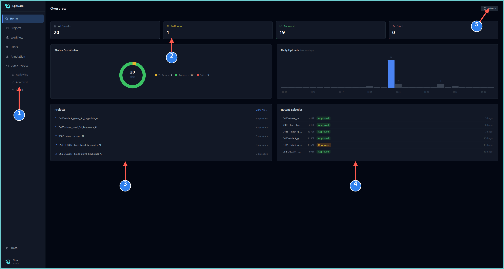

The numbered areas are:

1. Left navigation menu;
2. Summary statistics;
3. Project list;
4. Recent data;
5. Refresh button.

### 3.3 Data statuses

| Status | Meaning |
| --- | --- |
| Reviewing | Waiting for or undergoing inspection |
| Approved | Review passed |
| Failed | Processing failed |
| Trash | Deleted and recoverable |

### 3.4 How to use it

1. Sign in and open Home.
2. Check the summary statistics at the top.
3. Click a project name to view the project.
4. If the data is not current, click Refresh in the upper-right corner.

### 3.5 What indicates normal operation?

When data changes from Reviewing to Approved, its inspection is complete and it has passed review.

If Processing remains visible, wait and refresh the page. If it still does not change, check the Worker.

## 4. Projects and received data

### 4.1 What is a project?

A project stores a related group of data. One project can contain multiple Episodes.

processor receives data sent by the collector and stores it in the corresponding project. Data acquisition itself does not take place inside processor.

### 4.2 View existing projects

Open <code>Projects</code> in the left navigation to view existing projects and received data.

[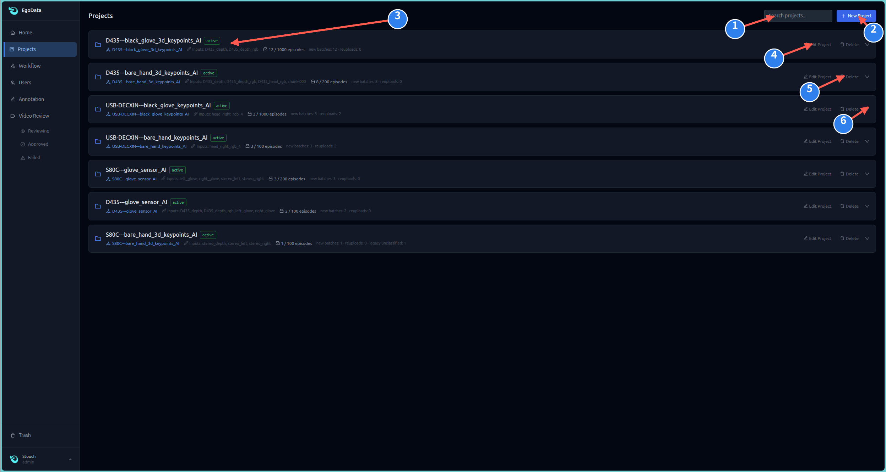](../images/projects-list-annotated.png)

The numbered controls are:

1. <code>Search projects</code>: enter a project name to find it quickly;
2. <code>New Project</code>: create a new project that will receive data;
3. <code>Project information</code>: view the project name, status, workflow, observed inputs, Episode count, and receiving statistics;
4. <code>Edit Project</code>: change the project name, workflow, or status;
5. <code>Delete</code>: delete the current project. Deleted data can be viewed in Trash;
6. <code>Expand received batches</code>: click the project row or the arrow on the right to view received batches and Episodes.

<code>active</code> means the project is in use and can continue receiving data. <code>paused</code> means the project is paused.

### 4.3 Create a project

Click <code>New Project</code> in the upper-right corner and enter the project information.

[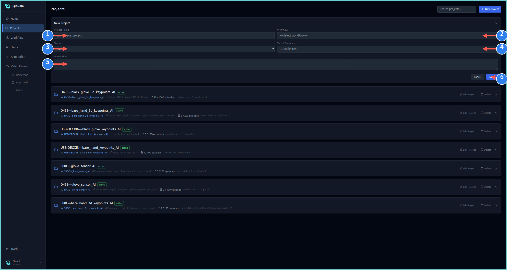](../images/project-new-annotated.png)

The fields are:

- <code>Project Name</code>: the project name;
- <code>Workflow</code>: bind one current workflow to the project. You may create a new empty workflow or select an existing workflow;
- <code>Status</code>: <code>active</code> enables the project and <code>paused</code> pauses it;
- <code>Target Episodes</code>: planned number of Episodes. <code>0</code> means no limit;
- <code>Description</code>: optional project description;
- <code>Save</code>: save the project.

The project name cannot be empty. After a new project is saved, the system asks whether you want to open the Workflow page and continue configuration.

### 4.4 Select a workflow

Select the required workflow from the <code>Workflow</code> field on the project form.

[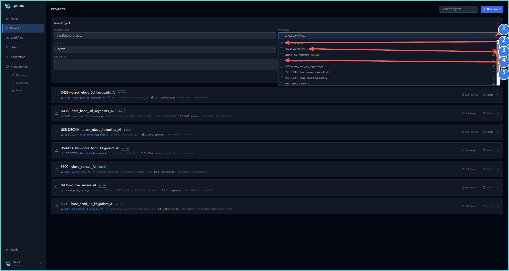](../images/project-workflow-select-annotated.png)

The workflow list provides:

1. Click the <code>Workflow</code> field to open the workflow list;
2. Click <code>+ New Workflow</code> to create an empty workflow;
3. A workflow with the <code>Template</code> tag is a template workflow;
4. Click an existing workflow name to bind it to the current project;
5. Click the button on the right to open and edit that workflow.

One project uses one current workflow. Selecting another workflow saves it as the project's new current workflow binding.

Choose according to the input data:

- Choose an RGB workflow for RGB data.
- Choose an RGB-D workflow for RGB plus Depth data.
- Choose a workflow containing Glove Sensor when glove sensor data is present.
- If you are unsure, confirm the project's input types before making a selection.

### 4.5 Data receiving process

    Collector generates data
      ↓
    Collector sends data
      ↓
    processor receives data
      ↓
    Extract and inspect
      ↓
    Match the project and workflow
      ↓
    New Episodes appear in the project

### 4.6 How to receive data

1. Create a project and select the correct workflow.
2. Keep the project status set to <code>active</code>.
3. Send data from the collector to processor.
4. Wait for processor to receive, extract, and inspect the data.
5. Expand the project and confirm that the new batch and Episodes appear.

When a project already has a workflow, the system processes newly received data. Without a bound workflow, data is only received and stored. If a workflow is bound and saved later, the system processes the existing batches.

### 4.7 Important notes

- Do not close the collector's sending program while data is being transferred.
- Do not send the same data again before extraction and inspection finish.
- Each Episode should contain its corresponding video or sensor data.
- If receiving fails, read the failure message before sending or processing the data again.
- Do not force a workflow to run when the project inputs do not match it.

## 5. Workflow

### 5.1 What is a workflow?

A workflow determines how received data is processed.

    Input data → Process data → Inspect results → Export data

### 5.2 Workflow page

Click <code>Workflow</code> in the left navigation.

[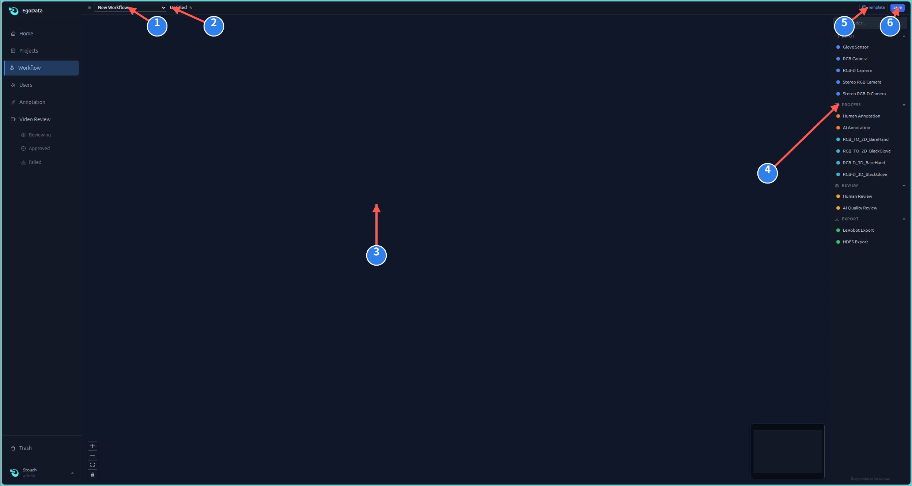](../images/workflow-empty-annotated.png)

The numbered controls are:

1. <code>Workflow selector</code>: switch between existing workflows or create a new workflow;
2. <code>Workflow name</code>: view or change the current workflow name;
3. <code>Canvas</code>: place nodes and connect them into a processing flow;
4. <code>Node list</code>: input, processing, review, and export nodes;
5. <code>Template</code>: start from a workflow template;
6. <code>Save</code>: save the current workflow.

### 5.3 Start from a template

Click <code>Template</code> in the upper-right corner and select a template that matches the received data.

[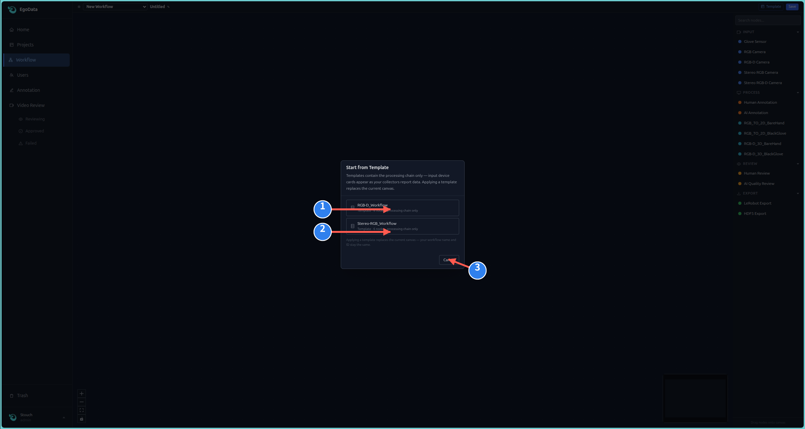](../images/workflow-template-annotated.png)

1. <code>RGB-D_Workflow</code>: a processing chain for RGB and depth data;
2. <code>Stereo-RGB_Workflow</code>: a processing chain for left and right RGB data;
3. <code>Cancel</code>: close the dialog without applying a template.

A template can be applied to a new or existing workflow. Applying it replaces the processing chain on the current canvas but does not change the current workflow name.

A template contains processing steps only. Input device nodes are generated from the data actually received by the project. If the canvas contains unsaved changes, save them before applying another template.

### 5.4 Check a complete workflow

The following image shows a connected workflow.

[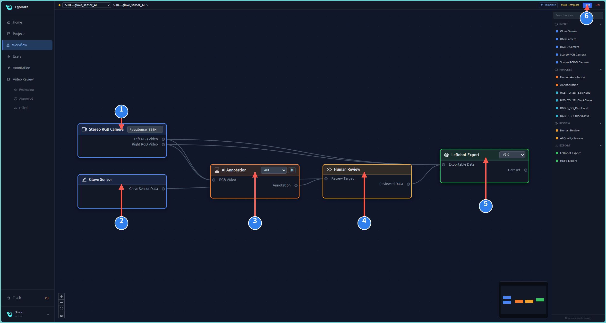](../images/workflow-editor-annotated.png)

1. <code>Stereo RGB Camera</code>: left and right RGB videos received by the project;
2. <code>Glove Sensor</code>: glove sensor data received by the project;
3. <code>AI Annotation</code>: generate task text and annotation segments from RGB video;
4. <code>Human Review</code>: send video, sensor data, and annotations for manual review;
5. <code>LeRobot Export</code>: prepare the data for export using the workflow settings;
6. <code>Save</code>: save the workflow after checking its connections.

In this example, the video, glove data, and AI annotations all enter manual review:

    Stereo RGB Camera ─┬→ AI Annotation ─┐
                       └─────────────────┤
    Glove Sensor ────────────────────────┤
                                        ↓
                                 Human Review
                                        ↓
                                 LeRobot Export

### 5.5 AI annotation settings

Open the settings dialog of the <code>AI Annotation</code> node to select the annotation language and API.

[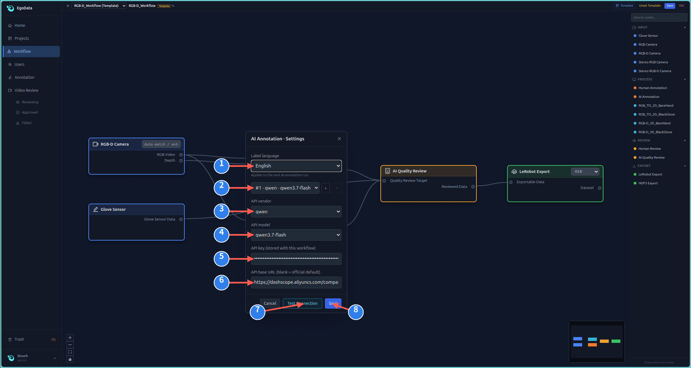](../images/workflow-ai-settings-annotated.png)

1. <code>Label Language</code>: choose Chinese or English annotations;
2. <code>Saved API Profile</code>: select a saved API profile;
3. <code>API Provider</code>: select the API provider;
4. <code>API Model</code>: enter or select the model;
5. <code>API Key</code>: enter the API key;
6. <code>API Base URL</code>: enter the API address. Leave it empty to use the provider's official default;
7. <code>Test Connection</code>: test whether the API is available before saving;
8. <code>Save</code>: save the AI annotation settings.

> API keys should appear masked. Do not share screenshots that reveal a complete API key.

### 5.6 Workflow module reference

The node list on the right is divided into <code>INPUT</code>, <code>PROCESS</code>, <code>REVIEW</code>, and <code>EXPORT</code>. Drag a node onto the canvas and connect its inputs and outputs.

#### INPUT: source data

| Module | Receives | Provides | When to use it |
| --- | --- | --- | --- |
| Glove Sensor | Glove pressure and joint data | Glove Sensor Data | When the project contains glove sensor data |
| RGB Camera | One color video | RGB Video | A monocular standard camera, monocular fisheye camera, or the color stream of an RGB-D camera |
| RGB-D Camera | Color video and a real depth stream | RGB Video, Depth | One RGB-D camera with depth data |
| Stereo RGB Camera | Left and right color videos | Left RGB Video, Right RGB Video | Stereo RGB video without a direct real-depth output |
| Stereo RGB-D Camera | Left and right color videos plus depth | Left RGB Video, Right RGB Video, Depth | Stereo video that also contains real depth |

#### PROCESS: processed data

| Module | Requires | Produces | Purpose |
| --- | --- | --- | --- |
| Human Annotation | RGB Video | Annotation | Manually create and edit task segments |
| AI Annotation | RGB Video | Annotation | Automatically generate Chinese or English annotations using a local model or API |
| RGB_TO_2D_BareHand | RGB Video | Hand 2D | Detect 2D keypoints in bare-hand video |
| RGB_TO_2D_BlackGlove | RGB Video | Hand 2D | Detect 2D keypoints in black-glove video |
| RGB-D_3D_BareHand | RGB Video + Depth | Hand 3D | Calculate real 3D bare-hand keypoints using matched depth data |
| RGB-D_3D_BlackGlove | RGB Video + Depth | Hand 3D | Calculate real 3D black-glove keypoints using matched depth data |

The <code>RGB_TO_2D</code> modules produce two-dimensional keypoints. Their spatial preview is for viewing only and is not exported as real metric 3D data.

#### REVIEW: inspect data

| Module | Purpose | Result |
| --- | --- | --- |
| Human Review | Let a user play the video and inspect keypoints, depth, sensor data, and annotations | Output Reviewed Data after approval |
| AI Quality Review | Automatically check decoding, frame continuity, black or frozen frames, and AI annotation coverage | Output Reviewed Data after passing; send abnormal data for manual handling |

#### EXPORT: export data

| Module | Purpose | Main settings |
| --- | --- | --- |
| LeRobot Export | Export a LeRobot dataset | Select v2.1 or v3.0; includes the corresponding meta, data, and videos |
| HDF5 Export | Export one HDF5 data file | Save with gzip compression |

Connect an export module after a review module so that only inspected and approved data enters the export flow.

### 5.7 Common workflow examples

Standard RGB:

    RGB → Hand 2D → Human Review → Export

RGB and depth:

    RGB + Depth → Hand 3D → Human Review → Export

RGB and glove sensor:

    RGB + Glove Sensor → Human Review → Export

### 5.8 Important rules

- Both RGB and Depth are required to calculate real 3D.
- RGB alone can produce 2D keypoints.
- A spatial preview produced from RGB alone is not real metric 3D.
- A step is skipped when its required input does not match the Episode.

<code>Input mismatch</code> means the workflow requires different data from the current project. Select a matching workflow.

## 6. Data annotation

### 6.1 Select data to annotate

Click <code>Annotation</code> in the left navigation. Expand a project on the right, then select an Episode.

[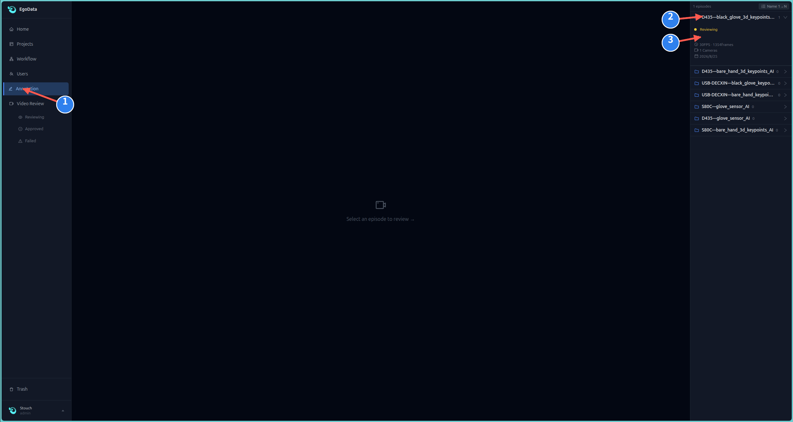](../images/annotation-list-annotated.png)

1. <code>Annotation</code>: open the Annotation page;
2. Click a project name to expand it;
3. Click an Episode number to load its video and existing annotations.

If the center shows <code>Select an episode to review</code>, no Episode has been selected. This is not a system failure.

### 6.2 View and edit annotations

[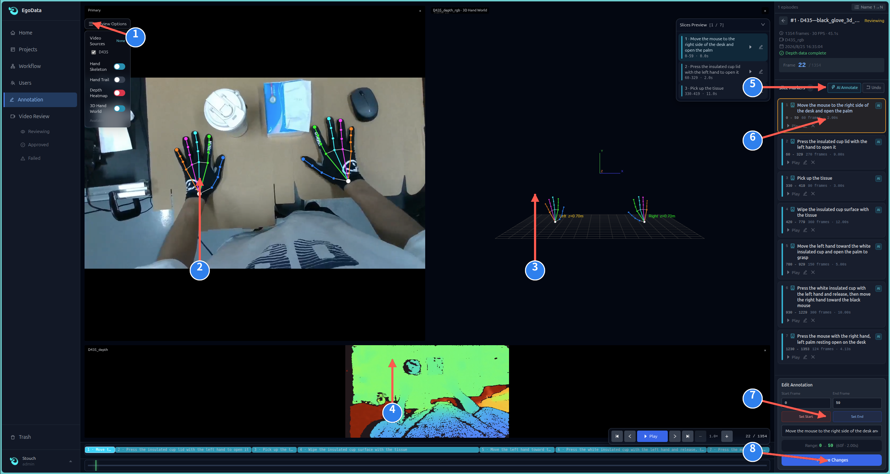](../images/annotation-editor-annotated.png)

1. <code>Preview Options</code>: show or hide keypoints, trails, depth, and 3D previews;
2. <code>RGB and 2D keypoints</code>: view the original image and 2D hand keypoints;
3. <code>3D hand space</code>: view hand keypoints in space;
4. <code>Depth pseudo-color preview</code>: view depth data in the browser;
5. <code>AI Annotate</code>: run AI annotation using the workflow settings;
6. <code>Annotation segment</code>: click a segment on the right to view or edit it;
7. <code>Set Start / Set End</code>: use the current frame as the segment's start or end frame;
8. <code>Save Changes</code>: save changes to the segment name and frame range.

### 6.3 Manually edit an annotation

1. Click the annotation segment that needs editing.
2. Check its start frame, end frame, and task name.
3. Make the changes and click <code>Save Changes</code>.
4. Check the annotation block on the timeline at the bottom.

### 6.4 AI annotation

1. Confirm that <code>AI Annotation</code> is configured in the workflow.
2. Select Chinese or English in the workflow settings.
3. Click <code>AI Annotate</code>.
4. Wait for the annotation segments to be generated.
5. Manually inspect the result and correct any errors.
6. If the workflow contains this feature, AI annotation runs automatically during workflow processing.
7. Network fluctuations may occasionally leave a short segment without annotation information.

## 7. Video viewing and review

### 7.1 Select data awaiting review

Click <code>Reviewing</code> under <code>Video Review</code>, then select an Episode from the right panel.

[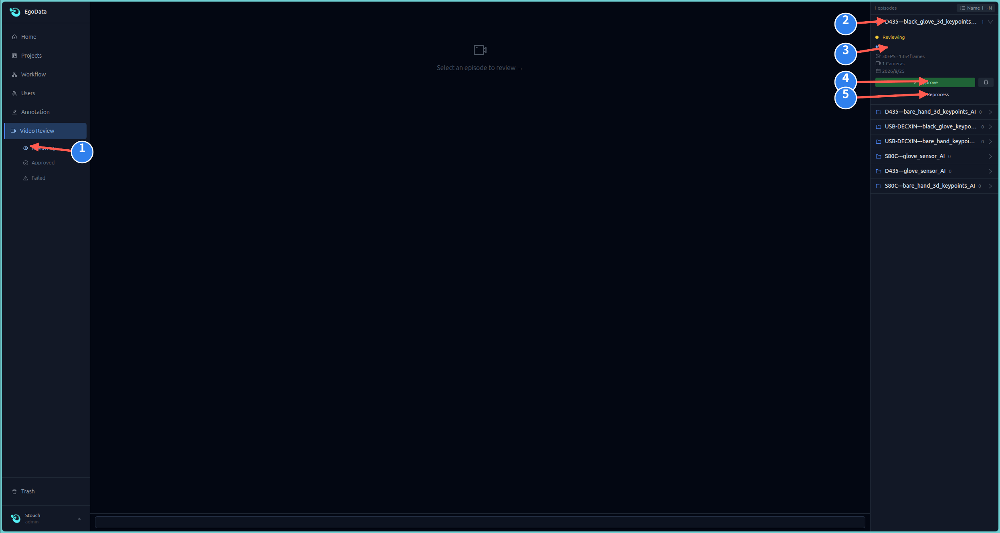](../images/reviewing-list-annotated.png)

1. <code>Reviewing</code>: view data waiting for manual review;
2. <code>Expand project</code>: view the Episodes in a project;
3. <code>Select Episode</code>: open the data and view its FPS, frame count, cameras, and processing status;
4. <code>Approve</code>: approve the current Episode after checking it;
5. <code>Reprocess</code>: run the workflow bound to the project again when the result is incorrect.

### 7.2 Inspect video and processing results

[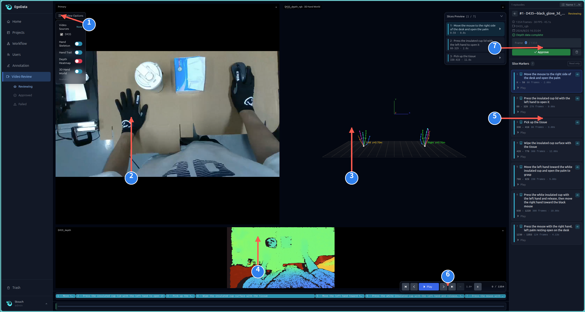](../images/reviewing-player-annotated.png)

1. <code>Preview Options</code>: show or hide different preview layers;
2. <code>RGB image</code>: view the color video. When keypoint display is enabled, 2D hand keypoints are overlaid;
3. <code>3D hand space</code>: inspect hand keypoints in space;
4. <code>Depth pseudo-color preview</code>: check whether the depth data looks normal;
5. <code>Read-only annotation segments</code>: inspect task names and frame ranges;
6. <code>Playback and frame controls</code>: play the video or inspect details with the previous-frame and next-frame buttons;
7. <code>Approve</code>: approve the current Episode.

Wait for the related data to finish loading before playback. RGB, 2D, 3D, depth, and sensor views should display the same frame number.

### 7.3 About the depth view

Blue, green, yellow, and other colors in the depth view are only a browser preview.

The depth video stores raw 12-bit depth codes. The pseudo-color image is not written back to the original data.

### 7.4 Common display problems

- Black screen: wait for the current Episode to load, then refresh the page.
- No 3D hand: check whether the workflow includes 3D processing and whether the Episode contains Depth.
- Keypoints do not move: reprocess that Episode.
- Playback stutters: wait until the related data has been cached before playing.

## 8. Approved data and export

### 8.1 Approved data

Click <code>Approved</code> under <code>Video Review</code> to view data that has passed review.

[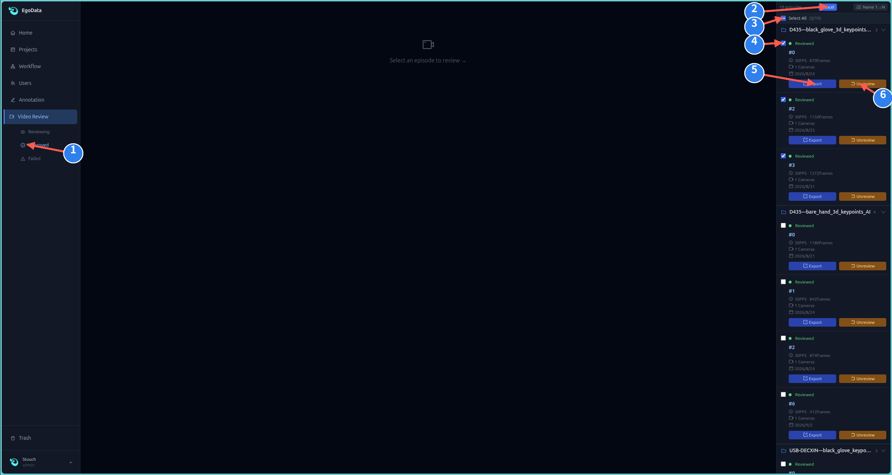](../images/approved-list-annotated.png)

1. <code>Approved</code>: open the Approved list;
2. <code>Multi-select mode</code>: click <code>Select</code> at the top of the page. The button changes to <code>Cancel</code> while this mode is active;
3. <code>Select All</code>: select every Episode in the current list;
4. <code>Episode checkbox</code>: select one Episode or multiple Episodes;
5. <code>Export</code>: export this single Episode;
6. <code>Unreview</code>: remove approval and return the Episode to the Reviewing list.

### 8.2 Export process

Export one Episode:

1. Click <code>Export</code> on that Episode's card.
2. Wait for the export to finish and download the archive.

Batch export:

1. Click <code>Select</code> at the top of the page.
2. Select one or more Episodes, or click <code>Select All</code>.
3. A <code>Batch Download</code> action bar appears after Episodes are selected.
4. Click <code>Batch Download</code> and wait for the export to finish.

The export format comes from the current workflow's export node, such as LeRobot 2.1, LeRobot 3.0, or HDF5. No separate export page is required.

### 8.3 Exported content

    Project name/
    ├── meta/       # Descriptions and statistics
    ├── data/       # Per-frame data, keypoints, and sensor data
    └── videos/     # Videos

Processed keypoints, annotations, and glove sensor data are exported together with the corresponding source data.

## 9. Failed data

### 9.1 Handling process

    See Failed
      ↓
    Open the failed data
      ↓
    Read the error message
      ↓
    Click Retry or Reprocess
      ↓
    Wait for processing

> Screenshot to be added: Failed page.

### 9.2 Common errors

| Error | What to do |
| --- | --- |
| No RGB | Check whether a color video was uploaded |
| No Depth | Real 3D cannot be calculated |
| Workflow mismatch | Select a matching workflow |
| AI annotation failed | Check the API settings and retry |
| Video cannot be opened | Send it again from the collector or contact the administrator |
| Worker is not running | Ask the administrator to restart the service |

If processing still fails after two retries, provide the data name, an error screenshot, the time of failure, and the steps that caused it.

## 10. Trash

### 10.1 What is Trash for?

Deleted data first enters Trash.

### 10.2 How to use it

[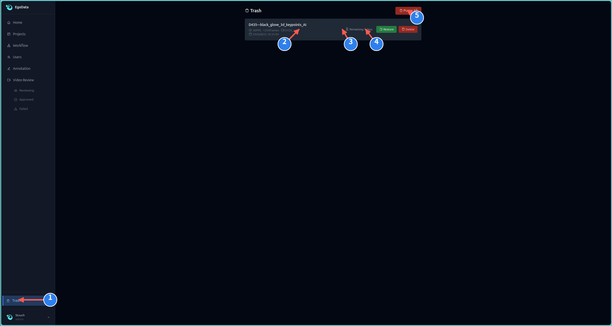](../images/trash-annotated.png)

1. Click <code>Trash</code> in the left navigation;
2. Check the remaining retention time;
3. Click <code>Restore</code> if the data should be kept;
4. Click <code>Delete</code> only when the data can be permanently removed;
5. <code>Purge All</code> permanently deletes everything in Trash.

### 10.3 Important notes

- Data in Trash can be restored.
- Permanently deleted data usually cannot be recovered.
- Confirm again before emptying Trash.
- If data cannot be found, first check its project name and deletion time.

## 11. Frequently asked questions

### The page does not open

Check whether the service is running.

### Data remains in Processing

Refresh the page. If the status does not change for a long time, the Worker may not be running.

### The depth view is black

Wait for loading to finish, refresh the page, and confirm that the current Episode really contains a depth video.

### There is 2D but no 3D

Real 3D requires both RGB and Depth. RGB alone cannot calculate real spatial positions.

### Playback stutters

Wait for loading to finish before playing. Use the previous-frame and next-frame buttons when checking details.

### AI annotation has no result

Check the API settings, model, network, and language, then run AI annotation again.

### Export fails

Confirm that the data has passed review, then export it again.

## 12. Data and program information

### 12.1 Project directory

    processor/
    ├── app/        # Backend, workflow, video, and export
    ├── worker/     # Background processing tasks
    ├── web/        # Pages and frontend code
    ├── scripts/    # Startup, inspection, and maintenance scripts
    ├── tests/      # Automated tests
    ├── deploy.py   # One-command deployment entry point
    └── .env        # Local configuration; do not commit to Git

### 12.2 Project data directory

    data/sessions/<project>/
    ├── data/
    ├── meta/
    └── videos/

Raw depth videos store depth codes. The browser's pseudo-color preview is not written back to the original data.

### 12.3 Startup checks

    python deploy.py --check-only
    python -m compileall app worker
    PYTEST_DISABLE_PLUGIN_AUTOLOAD=1 python -m pytest -q

Do not commit <code>.env</code>, API keys, tokens, real data, or server credentials to Git.

## 13. Code structure and responsibilities

This chapter explains the frontend, backend, Worker, and data-processing code behind the pages. Normal operation does not require changing these files. When maintaining a feature, use this chapter to find the corresponding code quickly.

### 13.1 System code flow

    Browser page
        ↓
    HTML templates and JavaScript
        ↓
    FastAPI backend APIs
        ↓
    Projects, Episodes, annotations, and workflows
        ↓
    Worker claims a processing job
        ↓
    Workflow modules run post-processing
        ↓
    Save keypoints, 3D, sensor, and annotation results
        ↓
    Video review and data export

Business data is primarily stored in project files. User accounts can use a database. The application retains a compatibility fallback when the database is temporarily unavailable.

### 13.2 Code directory tree

    processor/
    ├── app/                         # Python backend
    │   ├── main.py                  # FastAPI application entry point
    │   ├── config.py                # Environment variables and system settings
    │   ├── paths.py                 # Shared directory paths
    │   ├── localstore.py            # Project, workflow, and Episode file state
    │   ├── database.py              # User account database connection
    │   ├── models.py                # Database models
    │   ├── workflow_dispatch.py     # Workflow matching, dispatch, and backfill
    │   ├── workflow_bindings.py     # Bind workflows to actual device inputs
    │   ├── ai_annotation.py         # AI annotation service
    │   ├── export_engine.py         # Shared export-job logic
    │   ├── lerobot_export.py        # LeRobot 3.0 dataset generation
    │   ├── lerobot_v21.py           # LeRobot 2.1 compatibility
    │   ├── hdf5_export.py           # HDF5 dataset generation
    │   ├── routes/                  # Page and business APIs
    │   ├── api/                     # Project, workflow, and Worker APIs
    │   └── processing/              # Workflow processing framework
    │       ├── registry.py           # Automatic module registration
    │       ├── catalog.py            # Module catalog for the workflow page
    │       ├── batch.py              # Find videos and Parquet files in a batch
    │       └── modules/              # Execution code for workflow nodes
    ├── worker/                      # Background processing program
    │   ├── __main__.py              # Worker entry point
    │   ├── runner.py                # Claim and execute workflow jobs
    │   └── client.py                # Communicate with the backend Worker API
    ├── web/                         # Frontend pages
    │   ├── templates/               # HTML page templates
    │   ├── static/js/               # Page interaction, playback, and rendering
    │   └── workflow-studio/         # React workflow editor source
    ├── scripts/                     # Deployment, migration, and maintenance
    ├── tests/                       # Automated tests
    ├── models/                      # Local model files
    ├── docs/                        # Chinese and English documentation
    ├── deploy.py                    # One-command deployment entry point
    └── requirements*.txt            # Python dependencies

<code>.venv*</code>, <code>.pytest_cache</code>, and <code>.backups</code> are local environments, test caches, or backups. They are not part of the main business code.

### 13.3 Frontend code

The frontend has two parts:

1. Standard pages use HTML templates and plain JavaScript.
2. The workflow editor uses React and TypeScript.

#### Page templates

| File | Responsibility |
| --- | --- |
| <code>web/templates/base.html</code> | Common page frame, left navigation, and shared resources |
| <code>web/templates/overview.html</code> | Home page |
| <code>web/templates/tasks.html</code> | Project management page |
| <code>web/templates/index.html</code> | Annotation and video-review pages |
| <code>web/templates/trash.html</code> | Trash page |
| <code>web/templates/login.html</code> | Login page |
| <code>web/templates/users.html</code> | User management page, still under development |
| <code>web/templates/workflow_studio.html</code> | Workflow editor entry page |

#### Page JavaScript

| File | Responsibility |
| --- | --- |
| <code>web/static/js/dashboard.js</code> | Home statistics, recent data, and refresh |
| <code>web/static/js/tasks.js</code> | Create, edit, delete, and expand projects and batches |
| <code>web/static/js/app.js</code> | Episode list, review, deletion, and export actions |
| <code>web/static/js/player.js</code> | Video loading, central playback clock, and frame synchronization |
| <code>web/static/js/annotations.js</code> | Annotation segments, timeline, and frame-level annotation |
| <code>web/static/js/slice-preview.js</code> | Annotation segment preview in the upper-right corner |
| <code>web/static/js/hand-overlay.js</code> | Draw 2D hand keypoints over the RGB video |
| <code>web/static/js/depth-renderer.js</code> | Render raw 12-bit depth codes as browser pseudo-color |
| <code>web/static/js/heatmap.js</code> | Display glove sensor data in sync with video |
| <code>web/static/js/media-cache.js</code> | Cache keypoints and sensor data in IndexedDB |
| <code>web/static/js/i18n.js</code> | Chinese and English interface text |
| <code>web/static/js/login.js</code> | Login form |
| <code>web/static/js/users.js</code> | User management interactions, still under development |

The workflow editor source is in <code>web/workflow-studio/src/</code>. Its compiled files are in <code>web/static/workflow-studio/</code>. Change the source and rebuild the editor; do not edit the compiled output directly.

### 13.4 Backend entry point and page APIs

<code>app/main.py</code> is the backend entry point. It is responsible for:

- Starting FastAPI;
- Initializing file directories and the user database;
- Warming project and Episode metadata caches;
- Starting the upload processing queue;
- Registering page, project, video, annotation, workflow, and export APIs;
- Configuring static-file caching and large-media transfer behavior.

| File | Responsibility |
| --- | --- |
| <code>app/routes/pages.py</code> | Return the Home, Projects, Review, Workflow, and Trash pages |
| <code>app/routes/dashboard.py</code> | Home statistics, recent Episodes, and trends |
| <code>app/routes/session.py</code> | Receive archives, extract files, normalize directories, and import metadata |
| <code>app/routes/ingestion.py</code> | Episode list, details, approval, reprocessing, deletion, and restoration |
| <code>app/routes/video.py</code> | RGB video, depth code, depth preview, 2D, 3D, and sensor APIs |
| <code>app/routes/annotations.py</code> | Create, edit, delete, and read per-frame annotations |
| <code>app/routes/export.py</code> | Single export, batch export, export status, and downloads |
| <code>app/routes/auth.py</code> | Login, logout, and current-user APIs |
| <code>app/routes/devices.py</code> | Collector heartbeat and input capabilities |

### 13.5 Project, workflow, and Worker APIs

| File | Responsibility |
| --- | --- |
| <code>app/api/projects.py</code> | Create, edit, and delete projects; manage inputs and workflow bindings |
| <code>app/api/workflows.py</code> | Create, save, run, inspect usage, and retry workflows |
| <code>app/api/worker.py</code> | Claim jobs, download inputs, send heartbeats, and report completion or failure |
| <code>app/api/exceptions.py</code> | Aggregate and clear processing exceptions |
| <code>app/api/users.py</code> | Create users and manage roles, statuses, and deletion; still under development |

The backend and Worker job flow is:

    Backend creates a workflow run
        ↓
    Worker claims the job
        ↓
    Worker downloads the Episode input
        ↓
    Workflow nodes execute
        ↓
    Worker uploads the result and reports completion
        ↓
    Episode enters Reviewing or Approved

The Worker sends regular heartbeats. If it stops, the job is not immediately lost; the backend can schedule it again after the lease expires.

### 13.6 Workflow processing modules

In <code>app/processing/modules/</code>, one Python file usually represents one workflow node. Modules are registered automatically, displayed in the workflow editor, and executed by the Worker.

| Module file | Responsibility |
| --- | --- |
| <code>mono_camera.py</code> | Single RGB input |
| <code>rgbd_camera.py</code> | RGB and depth input |
| <code>stereo_camera.py</code> | Left and right stereo RGB input |
| <code>stereo_rgbd_camera.py</code> | Left and right RGB plus depth input |
| <code>glove_sensor.py</code> | Glove sensor input |
| <code>mediapipe_hand.py</code> | MediaPipe hand keypoint and gesture recognition |
| <code>rgb_hand_3d.py</code> | Bare-hand RGB 2D keypoints and spatial preview |
| <code>black_hand_rgb_3d.py</code> | Black-glove RGB 2D keypoints and spatial preview |
| <code>depth_hand_3d.py</code> | Real 3D calculation helper used by RGB-D hand modules; not a standalone node |
| <code>black_glove_hand.py</code> | Black-glove keypoint processing |
| <code>ai_annotation.py</code> | Declare and trigger automatic AI annotation |
| <code>annotation.py</code> | Human annotation workflow node |
| <code>human_review.py</code> | Human-review gate |
| <code>ai_quality_review.py</code> | Automatic video and annotation quality checks |
| <code>lerobot_export.py</code> | LeRobot export node |
| <code>hdf5_export.py</code> | HDF5 export node |

When adding a workflow module, check:

1. The module input and output types;
2. Whether the Worker can execute it;
3. Whether the workflow editor displays it correctly;
4. Whether the Review page can read its output;
5. Whether export modules include the new output.

### 13.7 Data, cache, and export code

| File | Responsibility |
| --- | --- |
| <code>app/localstore.py</code> | Scan and cache projects, Episodes, workflows, and run states |
| <code>app/storage.py</code> | Upload, validate, save, and remotely synchronize files |
| <code>app/remote_storage.py</code> | Remote storage access |
| <code>app/media_groups.py</code> | Organize RGB, depth, and sensor media groups |
| <code>app/media_cache.py</code> | Server-side media cache |
| <code>app/browser_preview.py</code> | Generate browser-compatible video previews |
| <code>app/artifact_resolver.py</code> | Locate workflow processing results |
| <code>app/export_engine.py</code> | Shared export flow |
| <code>app/lerobot_export.py</code> | Generate LeRobot 3.0 datasets |
| <code>app/lerobot_v21.py</code> | Generate and support LeRobot 2.1 data |
| <code>app/hdf5_export.py</code> | Generate HDF5 datasets |

Keep source data, processing results, and export copies distinct:

    data/sessions/     # Project source data and merged processing fields
    data/tmp/          # Temporary processing files
    Browser IndexedDB # Frontend preview cache; can be regenerated
    Export archives   # Delivery files generated from workflow settings

Do not store the browser's pseudo-color depth images as source data. The source depth remains raw depth codes.

### 13.8 Where to change a feature

| Feature | Frontend | Backend or processing |
| --- | --- | --- |
| Home statistics | <code>dashboard.js</code> | <code>routes/dashboard.py</code> |
| Projects page | <code>tasks.js</code> | <code>api/projects.py</code> |
| Upload and extraction | Projects page | <code>routes/session.py</code> |
| Workflow editor | <code>workflow-studio/src/</code> | <code>api/workflows.py</code> |
| Automatic workflow run | Project status display | <code>workflow_dispatch.py</code> |
| RGB video playback | <code>player.js</code> | <code>routes/video.py</code> |
| Playback frame synchronization | <code>player.js</code> | <code>routes/video.py</code> |
| 2D hand keypoints | <code>hand-overlay.js</code> | Hand-processing modules |
| 3D hand space | <code>player.js</code> | <code>processing/modules/*3d*.py</code> |
| Depth pseudo-color | <code>depth-renderer.js</code> | <code>routes/video.py</code> |
| Glove sensor | <code>heatmap.js</code> | <code>glove_sensor.py</code> |
| Annotation timeline | <code>annotations.js</code> | <code>routes/annotations.py</code> |
| AI annotation | <code>annotations.js</code> | <code>ai_annotation.py</code> |
| Video review | <code>app.js</code> | <code>routes/ingestion.py</code> |
| Single and batch export | <code>app.js</code> | <code>routes/export.py</code> |
| LeRobot format | Export button | <code>lerobot_export.py</code>, <code>lerobot_v21.py</code> |
| HDF5 format | Export button | <code>hdf5_export.py</code> |
| Trash | <code>trash.html</code> | <code>routes/ingestion.py</code> |
| User management | <code>users.js</code> | <code>api/users.py</code> |

### 13.9 Troubleshooting order

When a problem occurs, check it in this order:

1. Confirm which page shows the problem.
2. Find the JavaScript file used by that page.
3. Check the browser developer tools for failed API requests.
4. Use the API address to find the corresponding Python route.
5. If it is a workflow job, inspect the Worker and processing module.
6. If displays are out of sync, inspect the current Episode's frame count, FPS, and cache.
7. Run the tests after making changes, then validate with real data.

## Closing note

Receive the data first, process it next, inspect it after processing, and export it only after it passes review.
